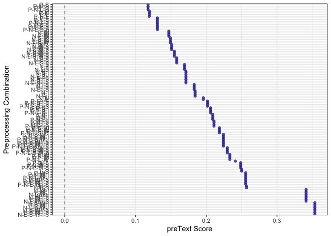
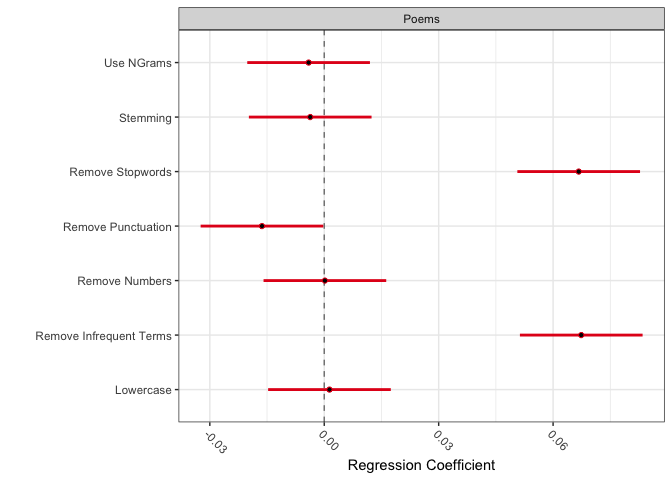
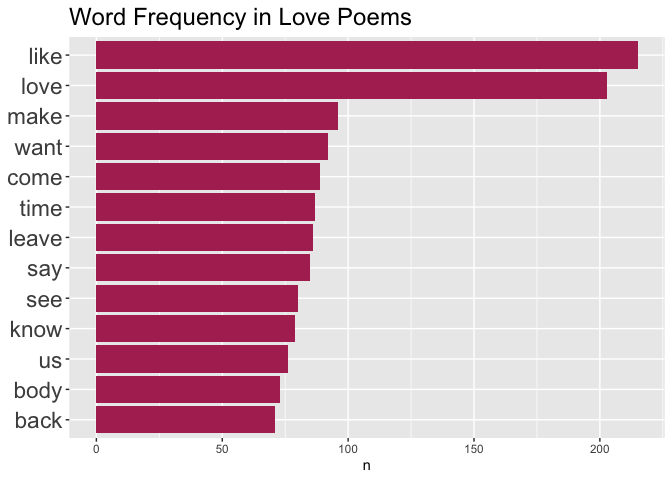
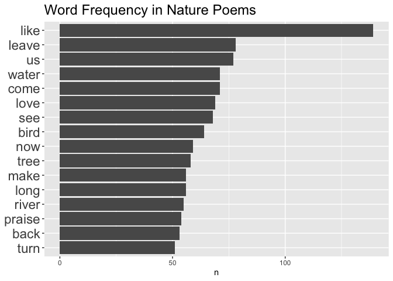
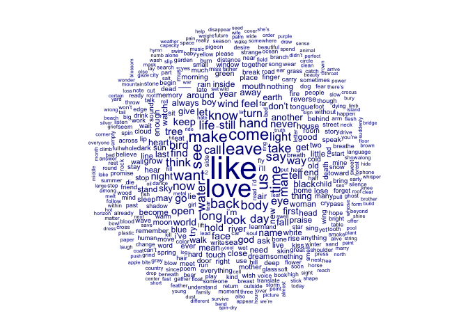
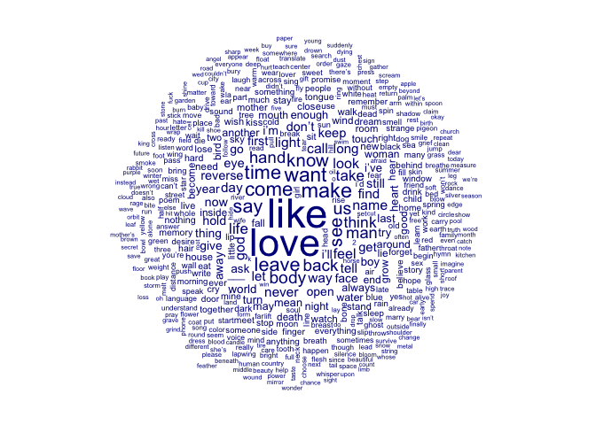
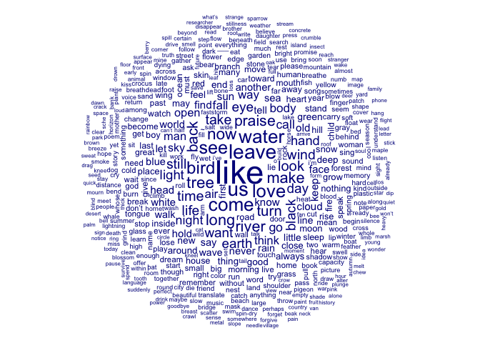
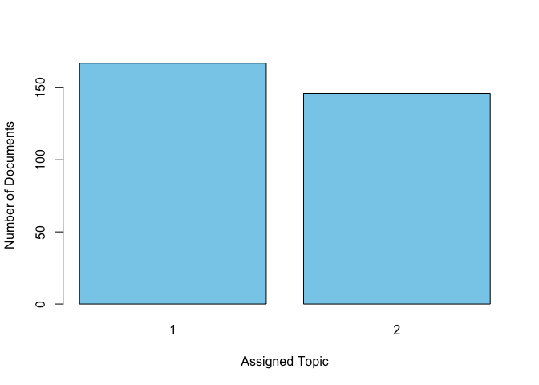
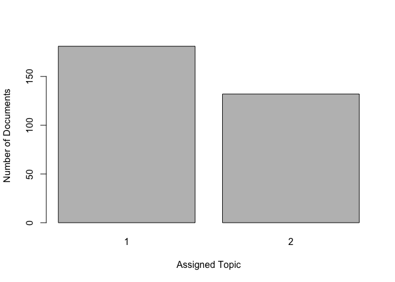
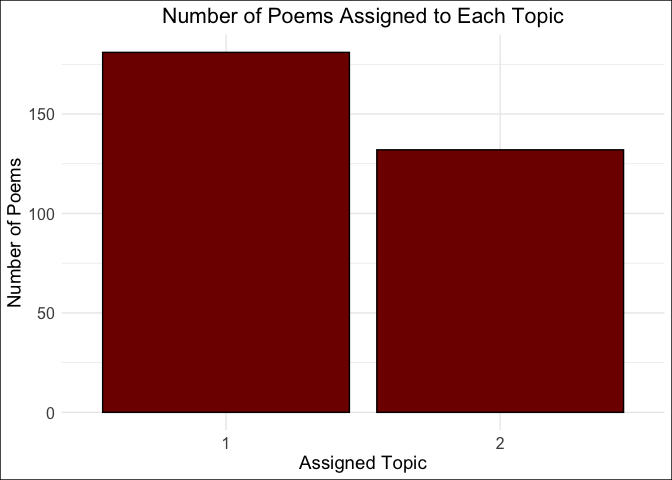

A Comparative Study of Machine Learning Models for Poetry Classification
================
2024-05-18

# **Introduction**

Artificial intelligence is progressing rapidly, and in recent years
society has seen the rise of its use for image classification in
self-driving cars, medical diagnoses, and the generation of videos,
edited images, and animated art. But despite the circulation of AI’s
various feats throughout the internet, it still falls short of
reproducing certain forms of human work. For instance, AI fails to
create poetry with the same level of imaginative authenticity possessed
by talented writers. Able to mimic poetic styles and merge existing
ideas, drawing on patterns and cadence found in literature, AI produces
text which technically passes as poetry, but which tends to be trite and
lack inspiration. AI does not tend to conceptualize entirely new ideas
or capture emotions in novel ways, as it lacks conscious thought. Poetry
is a very human art form.

However, while it remains incapable of creating the best poetry, natural
language processing has indeed made immense leaps in its capacity to
process and extract information from complex text. Poetry tends to be
abstract, sometimes purposefully ommitting explanation and leaving its
experience up to personal emotional interpretation. Despite this,
language processers have developed an improved capacity in recent years
to parse through poetry and summarize the main points.

In this project, I set out to test a variety of machine learning models
to assess their accuracy in processing poetry, specifically in
classifying poetry based on topic.

For my data set, I scrape a collection of poems off The Poetry
Foundation website. The Poetry Foundation is an organization which
gathers and presents a large collection of poetry. It also categorizes
them by topic. This categorization is derived from the work of
employees, who read through the poetry and manually categorized them.
For this project, I will gather poems from the website which are
categorized under the topic “love” and “nature”.

On the resulting data set, I will perform three classifiers and compare
their accuracy. Specifically, I will implement LDA and correlated topic
models, both of which are unsupervised learning methods, and support
vector machines, a supervised method, to classify the poems. For the
topic models, I will let the algorithm classify the poems into two
categories, and then compare its classification with that of The Poetry
Foundation’s. For support vector machines, I will train the data on
poems and their topics, as classified by The Poetry Foundation, and then
test the model’s classification abilities by validating on a test set.

The overall goal of this project is to assess the ways various machine
learning classifiers parse through poetry, and determine how well their
decisions align with manual human classification. Can computational
methods mimic human classification, despite their inability to
consciously comprehend poetry?

# Step 1: Data Import via Web Scraping

The first step is to use web scraping to gather a collection of poems
and relevant metadata.

As mentioned, on the Poetry Foundation website, it is possible to
categorize poems by topic. Once categorized, the user can choose a poem,
and click to access the webpage for a single poem. I assessed these
webpages, and found that there is a general structure in common among
them. This makes it possible to use a shared strategy to extract
information across the pages.

Below, I create a function ‘poem_reader’, which extracts the poem,
title, and author by CSS selector off a poem’s webpage. I experimented
with various CSS selectors. For instance, I found that
‘div.c-feature-bd’, yields a character vector, in which the first
element is the text, the second is the author, and the third is a
description of the author. I chose to use ‘div.o-vr.o-vr_12x’, which
provides the title, a button to ‘Launch Audio’, the author, and the poem
text.

``` r
css_selector = "div.o-vr.o-vr_12x"
poem_reader <- function(url){
  love_poem <- url %>%
    read_html() %>% 
    html_nodes(css = css_selector) %>%
    html_text2()
  return(love_poem)
}
```

Now I will create a list called ‘og_love_poems’ which contains all the
extracted love poems and associated metadata. I will start by collecting
the links for all the love poems I want to include in the data set,
storing them as a list, and then applying the ‘poem_reader’ function to
all of the urls.

``` r
# Create a list which contains the links to the love poems  
urls_love <- c("https://www.poetryfoundation.org/poetrymagazine/poems/161134/in-the-house-by-the-sea", "https://www.poetryfoundation.org/poetrymagazine/poems/161112/you-on-a-table-in-someone-elses-hands", "https://www.poetryfoundation.org/poems/160950/later-64dd12471ec0c", "https://www.poetryfoundation.org/poems/160947/three-love-chants", "https://www.poetryfoundation.org/poems/160772/after-love-64c145bf616a5", "https://www.poetryfoundation.org/poetrymagazine/poems/160519/breed-me", "https://www.poetryfoundation.org/poetrymagazine/poems/160475/down-the-lane", "https://www.poetryfoundation.org/poems/160555/bar-napkin-sonnet-11-6481e190716ad", "https://www.poetryfoundation.org/poems/160539/i-love-you-to-the-moon-", "https://www.poetryfoundation.org/poems/160540/self-portrait-with-sylvia-plaths-braid", "https://www.poetryfoundation.org/poems/160541/small-murders", "https://www.poetryfoundation.org/poetrymagazine/poems/160061/the-language-of-dust", "https://www.poetryfoundation.org/poetrymagazine/poems/159790/the-longest-way-round", "https://www.poetryfoundation.org/poetrymagazine/poems/159809/to-you-from-your-secret-admirer", "https://www.poetryfoundation.org/poetrymagazine/poems/159617/red-rum", "https://www.poetryfoundation.org/poetrymagazine/poems/159626/snake-plant", "https://www.poetryfoundation.org/poems/159491/a-memory-of-us", "https://www.poetryfoundation.org/poems/159331/every-cell-in-this-country-looks-like-a-choice-you-can-walk-in-and-out-of", "https://www.poetryfoundation.org/poems/159110/wulf-and-eadwacer-636eaf9d0772d", "https://www.poetryfoundation.org/poems/158617/god-speaks-to-the-soul", "https://www.poetryfoundation.org/poems/158619/how-god-answers-the-soul", "https://www.poetryfoundation.org/poems/158470/out-of-these-wounds-the-moon-will-rise", "https://www.poetryfoundation.org/poems/158329/i-met-a-man-a-dying-man", "https://www.poetryfoundation.org/poems/158328/intimacy-unhinged-unpaddocked-me", "https://www.poetryfoundation.org/poems/158330/it-is-abominable-unquenchable-by-touch", "https://www.poetryfoundation.org/poems/158331/vietnam-ghost-story-a-lat-lovers", "https://www.poetryfoundation.org/poems/158007/i-don39t-want-to-love-you-the-way-you-love-me", "https://www.poetryfoundation.org/poems/158008/this-can39t-be-dangerous", "https://www.poetryfoundation.org/poems/47462/virgin", "https://www.poetryfoundation.org/poems/157903/el-beso", "https://www.poetryfoundation.org/poems/157589/o-friends", "https://www.poetryfoundation.org/poems/157474/the-stronger", "https://www.poetryfoundation.org/poems/156823/portent", "https://www.poetryfoundation.org/poems/156686/life-centered-around", "https://www.poetryfoundation.org/poems/156608/garden-61644221ab64a", "https://www.poetryfoundation.org/poetrymagazine/poems/156434/miss-you-would-like-to-grab-that-chilled-tofu-we-love", "https://www.poetryfoundation.org/poetrymagazine/poems/156433/miss-you-would-like-to-take-a-walk-with-you", "https://www.poetryfoundation.org/poetrymagazine/poems/156316/this-is-not-about-us-its-just-about-desire-and-the-plague", "https://www.poetryfoundation.org/poetrymagazine/poems/156320/turnstile-jumping",
"https://www.poetryfoundation.org/poetrymagazine/poems/156059/death-wish",
"https://www.poetryfoundation.org/poetrymagazine/poems/156078/filling-spice-jars-as-your-wife",
"https://www.poetryfoundation.org/poetrymagazine/poems/156082/in-the-bone-cracking-cold",
"https://www.poetryfoundation.org/poetrymagazine/poems/156050/a-poem-for-indigo",
"https://www.poetryfoundation.org/poetrymagazine/poems/156068/poem-for-the-black-bird",
"https://www.poetryfoundation.org/poetrymagazine/poems/156055/tanaga-for-philippine-american-lovers",
"https://www.poetryfoundation.org/poetrymagazine/poems/155917/in-another-string-of-the-multiverse-perhaps",
"https://www.poetryfoundation.org/poetrymagazine/poems/155912/not-everything-is-sex",
"https://www.poetryfoundation.org/poetrymagazine/poems/155924/still-doing-it",
"https://www.poetryfoundation.org/poems/155944/her-garden-609ac2408d90a",
"https://www.poetryfoundation.org/poems/155847/beast-and-beauty",
"https://www.poetryfoundation.org/poetrymagazine/poems/155676/domestic-violence-603e6a1ca9c3f",
"https://www.poetryfoundation.org/poetrymagazine/poems/155672/elegy-falling-forward-down",
"https://www.poetryfoundation.org/poetrymagazine/poems/155668/from-melismas",
"https://www.poetryfoundation.org/poetrymagazine/poems/155667/in-love-as-in-tourism",
"https://www.poetryfoundation.org/poetrymagazine/poems/155660/king-friday-and-the-land-of-make-believe",
"https://www.poetryfoundation.org/poetrymagazine/poems/155512/kara-jackson-the-world-is-about-to-end-and-my-grandparents-are-in-love",
"https://www.poetryfoundation.org/poetrymagazine/poems/155503/love-letter-601d832de2b22",
"https://www.poetryfoundation.org/poems/155044/the-subway-lovers",
"https://www.poetryfoundation.org/poems/155567/and-these-are-lips",
"https://www.poetryfoundation.org/poems/155587/satan-be-gone",
"https://www.poetryfoundation.org/poetrymagazine/poems/155243/bruises-5ff7b464a6237",
"https://www.poetryfoundation.org/poems/155156/like-air",
"https://www.poetryfoundation.org/poems/155342/waiting-2",
"https://www.poetryfoundation.org/poems/155098/do-you-have-anything",
"https://www.poetryfoundation.org/poems/155041/bourbon-with-petrarch",
"https://www.poetryfoundation.org/poems/155043/leaving-5fd27db368c3c",
"https://www.poetryfoundation.org/poems/154603/coochy-coo",
"https://www.poetryfoundation.org/poems/154929/absence-presence",
"https://poetryfoundation.org/poems/154923/elegy-for-loss",
"https://www.poetryfoundation.org/poems/154891/how-to-measure-distance",
"https://www.poetryfoundation.org/poems/154927/a-reparation",
"https://www.poetryfoundation.org/poems/154804/love-in-a-time-of-climate-change",
"https://www.poetryfoundation.org/poems/154772/here-it-is",
"https://www.poetryfoundation.org/poems/154789/v-here-is-my-propaganda-one-one-one-one-oneing-on-your-forehead-like-droplets-of-luminous-sin",
"https://www.poetryfoundation.org/poems/154773/wall-5fa982e07adb1",
"https://www.poetryfoundation.org/poems/154790/x-dance-of-the-western-union-envelope-how-the-heart-leaps-up-more-eager-than-plant-or-beast",
"https://www.poetryfoundation.org/poetrymagazine/poems/154980/bird-in-the-rain",
"https://www.poetryfoundation.org/poetrymagazine/poems/155054/double-helix-kyrie", "https://www.poetryfoundation.org/poetrymagazine/poems/154983/for-y", "https://www.poetryfoundation.org/poetrymagazine/poems/155001/gardens-of-babur-kabul", "https://www.poetryfoundation.org/poetrymagazine/poems/154979/a-tangle-of-gorgons",
"https://www.poetryfoundation.org/poetrymagazine/poems/154987/triple-sonnet-because-boy-youre-starstruck-and-im-a-wonder",
"https://www.poetryfoundation.org/poetrymagazine/poems/154988/triple-sonnet-for-celebrities-with-three-names",
"https://www.poetryfoundation.org/poems/154761/boardwalk-5fa599252e189",
"https://www.poetryfoundation.org/poems/154765/lowering-of-the-gaze",
"https://www.poetryfoundation.org/poetrymagazine/poems/154676/from-the-couplets",
"https://www.poetryfoundation.org/poetrymagazine/poems/154669/thine-will-be-done",
"https://www.poetryfoundation.org/poems/154746/spring-song-5fa4488082a95",
"https://www.poetryfoundation.org/poems/154753/what-i-never-told-you-about-the-marriage",
"https://www.poetryfoundation.org/poems/154737/after-the-beginning-before-the-end",
"https://www.poetryfoundation.org/poems/154718/crush-supermarket-california",
"https://www.poetryfoundation.org/poems/154723/outside-the-new-body",
"https://www.poetryfoundation.org/poems/154720/we-drive-home-from-the-lake-sand-in-our-shoes",
"https://www.poetryfoundation.org/poetrymagazine/poems/154460/excavation",
"https://www.poetryfoundation.org/poetrymagazine/poems/154466/pygmalion-5f766d05354f7",
"https://www.poetryfoundation.org/poems/154419/ditty-5f71fa7cb8f38",
"https://www.poetryfoundation.org/poems/154421/the-great-fires",
"https://www.poetryfoundation.org/poems/154386/if-this-new-love-ends",
"https://www.poetryfoundation.org/poems/154422/poem-a-la-recherche-d-gertrude-stein",
"https://www.poetryfoundation.org/poems/154387/ring",
"https://www.poetryfoundation.org/poetrymagazine/poems/154219/after-yellow-crane-tower",
"https://www.poetryfoundation.org/poetrymagazine/poems/154208/dear-life",
"https://www.poetryfoundation.org/poetrymagazine/poems/154228/eclat-cast-lots",
"https://www.poetryfoundation.org/poetrymagazine/poems/154224/in-defense-of-a-long-engagement",
"https://www.poetryfoundation.org/poetrymagazine/poems/154209/the-oracle-was-stoned",
"https://www.poetryfoundation.org/poetrymagazine/poems/154230/savory-versus-sweet",
"https://www.poetryfoundation.org/poems/154262/under-the-roof-of-memory",
"https://www.poetryfoundation.org/poems/154123/rivermouth",
"https://www.poetryfoundation.org/poems/153968/sideman",
"https://www.poetryfoundation.org/poems/153944/the-song-is-you",
"https://www.poetryfoundation.org/poetrymagazine/poems/153801/autobiography-of-my-hungers",
"https://www.poetryfoundation.org/poetrymagazine/poems/153802/lines-written-at-federico-garcia-lorca-park",
"https://www.poetryfoundation.org/poetrymagazine/poems/153803/postmortem",
"https://www.poetryfoundation.org/poems/153877/somewhere-i-have-never-travelledgladly-beyond",
"https://www.poetryfoundation.org/poetrymagazine/poems/153507/should-you-turn-finally-to-face-me",
"https://www.poetryfoundation.org/poetrymagazine/poems/153506/tickled-sync",
"https://www.poetryfoundation.org/poetrymagazine/poems/153528/with-wayward-motion",
"https://www.poetryfoundation.org/poetrymagazine/poems/153227/how-candles-are-made",
"https://www.poetryfoundation.org/poems/153338/i-forget-who-i-said-it-to-but-i-remember-how-afterwards-they-looked-at-me-as-though-i-had-driven-a-steak-knife-through-their-mothers-hand",
"https://www.poetryfoundation.org/poems/153273/poem-for-three-dead-girls-of-last-summer",
"https://www.poetryfoundation.org/poems/153027/father39s-day-for-gay-boys",
"https://www.poetryfoundation.org/poems/55584/the-promise-56d23752834aa",
"https://www.poetryfoundation.org/poetrymagazine/poems/152954/spinal-blade",
"https://www.poetryfoundation.org/poetrymagazine/poems/152939/what-carries-us",
"https://www.poetryfoundation.org/poems/152735/i-find-myself-defending-pigeons",
"https://www.poetryfoundation.org/poems/152729/duplex",
"https://www.poetryfoundation.org/poems/152832/fayetteville-junior-high",
"https://www.poetryfoundation.org/poems/152783/meeting-the-light-completely",
"https://www.poetryfoundation.org/poems/152743/ode-to-patrick-swayze",
"https://www.poetryfoundation.org/poetrymagazine/poems/152094/fingers-on-a-gay-man",
"https://www.poetryfoundation.org/poetrymagazine/poems/152101/at-least-a-dozen-bluets",
"https://www.poetryfoundation.org/poetrymagazine/poems/152095/for-baron-b",
"https://www.poetryfoundation.org/poetrymagazine/poems/152105/gangnam-beauty",
"https://www.poetryfoundation.org/poetrymagazine/poems/151735/all-my-friends-are-finding-new-beliefs",
"https://www.poetryfoundation.org/poetrymagazine/poems/151820/a-daily-prayer",
"https://www.poetryfoundation.org/poetrymagazine/poems/151745/from-unexhausted-time",
"https://www.poetryfoundation.org/poetrymagazine/poems/151743/ghosts-homage-to-burial",
"https://www.poetryfoundation.org/poetrymagazine/poems/151765/june-8-the-smiley-barista-remembers-my-name",
"https://www.poetryfoundation.org/poetrymagazine/poems/151749/lapwing",
"https://www.poetryfoundation.org/poetrymagazine/poems/151751/meeting-5de339704bde5",
"https://www.poetryfoundation.org/poetrymagazine/poems/151771/t4t",
"https://www.poetryfoundation.org/poetrymagazine/poems/151750/torn-coat",
"https://www.poetryfoundation.org/poems/151848/i-save-my-love",
"https://www.poetryfoundation.org/poems/151852/maybe-under-some-other-sky",
"https://www.poetryfoundation.org/poems/151844/the-thing-is",
"https://www.poetryfoundation.org/poetrymagazine/poems/151517/ars-poetica-5dc04e4e608b9",
"https://www.poetryfoundation.org/poetrymagazine/poems/151491/bone-appendix",
"https://www.poetryfoundation.org/poetrymagazine/poems/151518/february-my-love-is-in-another-state",
"https://www.poetryfoundation.org/poetrymagazine/poems/151490/headless-mama-returns-xmas-18-redux",
"https://www.poetryfoundation.org/poetrymagazine/poems/151482/hitting-bottom",
"https://www.poetryfoundation.org/poetrymagazine/poems/151488/palmistry",
"https://www.poetryfoundation.org/poetrymagazine/poems/151499/snowballing",
"https://www.poetryfoundation.org/poetrymagazine/poems/151530/to-memorize-the-continuous-lines-of-your-bones-an-american-lullaby",
"https://www.poetryfoundation.org/poetrymagazine/poems/151505/what-follows-is-a-reconstruction-based-on-the-best-available-evidence",
"https://www.poetryfoundation.org/poetrymagazine/poems/151504/your-shadow-invents-you-every-time-light-fails-to-pass-through-you",
"https://www.poetryfoundation.org/poems/151636/first-kiss-5dcdab171516d",
"https://www.poetryfoundation.org/poetrymagazine/poems/151151/flammagenitus-strophes")

# Apply the poem_reader function to every link in 'urls_love' and store the output in 'og_love_poems'
og_love_poems <- lapply(urls_love, poem_reader)
```

Now, ‘og_love_poems’ is a list which stores 157 love poems, as well as
their respective titles and authors.

I will repeat this process for poems on the topic of nature, storing
them in a list called ‘og_nature_poems’.

Initially, I listed the links for all the poems from the first eight
pages displayed on The Poetry Foundation website under the topic
‘nature’. I had to eliminate two of the URL’s upon finding that they
were causing issues. On second glance, I found their pages contained
poetry ‘images’, rather than text, so they were not suitable for
analysis. For this reason, it is important to always inspect the output
of the web scraping process to ascertain it is in the form expected.

``` r
# Below, 'urls_nature' contains the links to 156 poems on the topic of nature
# I removed poem #54 (https://www.poetryfoundation.org/poetrymagazine/poems/156124/remember-the-wind) and #55  (https://www.poetryfoundation.org/poetrymagazine/poems/156121/solstice-blessing) because they were poem images (poetry made out of a diagram) and didn't allow for text extraction. 

urls_nature <- c("https://www.poetryfoundation.org/poetrymagazine/poems/160845/august-15", "https://www.poetryfoundation.org/poetrymagazine/poems/160858/selfishness", "https://www.poetryfoundation.org/poems/161060/im-going-back-to-minnesota-where-sadness-makes-sense", "https://www.poetryfoundation.org/poems/160769/wing", "https://www.poetryfoundation.org/poems/160746/trees-64baafe6b9ccd", "https://www.poetryfoundation.org/poems/160604/cloud-hands", "https://www.poetryfoundation.org/poems/160603/the-shapes-of-leaves", "https://www.poetryfoundation.org/poems/160592/at-the-equinox", "https://www.poetryfoundation.org/poems/160376/knoxville-tennessee", "https://www.poetryfoundation.org/poems/160375/tour", "https://www.poetryfoundation.org/poetrymagazine/poems/160014/postscript-64271592ebbd2", "https://www.poetryfoundation.org/poems/160107/strolling-2020-", "https://www.poetryfoundation.org/poems/159959/poem-for-r", "https://www.poetryfoundation.org/poems/159476/in-the-season-of-pink-ladies", "https://www.poetryfoundation.org/poems/159491/a-memory-of-us", "https://www.poetryfoundation.org/poems/159330/i-have-never-seen-volcanoes-175", "https://www.poetryfoundation.org/poems/159135/a-bird-in-bishopswood", "https://www.poetryfoundation.org/poems/158676/pier39s-end", "https://www.poetryfoundation.org/poems/157902/the-black-finger", "https://www.poetryfoundation.org/poems/157594/from-the-first-villancico", "https://www.poetryfoundation.org/poems/157592/the-great-sea", "https://www.poetryfoundation.org/poems/157466/for-the-boy-standing-under-the-drainpipe", "https://www.poetryfoundation.org/poems/157464/nebi", "https://www.poetryfoundation.org/poems/157465/red-6213f34ee1519", "https://www.poetryfoundation.org/poems/157195/on-falling-blue-spruce", "https://www.poetryfoundation.org/poems/156951/the-disappearance-of-the-duwamish-salmon", "https://www.poetryfoundation.org/poems/156957/the-golden-record", "https://www.poetryfoundation.org/poems/156959/staying-power-61afd29733f35", "https://www.poetryfoundation.org/poems/156845/black-earth-6196c6796f9b8", "https://www.poetryfoundation.org/poems/156844/do-not-compare-what-lives-is-incomparable", "https://www.poetryfoundation.org/poems/156841/i-was-washing-at-night-out-in-the-yard", "https://www.poetryfoundation.org/poems/156843/my-goldfinch-i39ll-toss-back-my-head", "https://www.poetryfoundation.org/poems/156719/street-view", "https://www.poetryfoundation.org/poems/156717/internet-support-group", "https://www.poetryfoundation.org/poems/156716/when-treatment-isn't-enough", "https://www.poetryfoundation.org/poems/156684/white-factory", "https://www.poetryfoundation.org/poems/156664/bonfire", "https://www.poetryfoundation.org/poems/156655/the-sister-karamazov", "https://www.poetryfoundation.org/poems/156607/tennesse-valley-authority", "https://www.poetryfoundation.org/poetrymagazine/poems/156407/american-hay-fever", "https://www.poetryfoundation.org/poems/156523/daybreak-61575cce7533d",
"https://www.poetryfoundation.org/poetrymagazine/poems/156423/load-more",
"https://www.poetryfoundation.org/poetrymagazine/poems/156405/outbreaks",
"https://www.poetryfoundation.org/poems/156520/plans-fo-altering-the-river",
"https://www.poetryfoundation.org/poems/156247/ashberries-letters",
"https://www.poetryfoundation.org/poetrymagazine/poems/156299/blue-chore-coat",
"https://www.poetryfoundation.org/poetrymagazine/poems/156312/never-describe-the-sky-as-azure",
"https://www.poetryfoundation.org/poetrymagazine/poems/156318/queer-appalachia",
"https://www.poetryfoundation.org/poetrymagazine/poems/156316/this-is-not-about-us-its-just-about-desire-and-the-plague",
"https://www.poetryfoundation.org/poetrymagazine/poems/156044/aubade-tanka",
"https://www.poetryfoundation.org/poetrymagazine/poems/156080/bee-whisperer",
"https://www.poetryfoundation.org/poetrymagazine/poems/156084/heres-an-ocean-tale",
"https://www.poetryfoundation.org/poetrymagazine/poems/156074/plastic-a-personal-history",
"https://www.poetryfoundation.org/poetrymagazine/poems/156073/to-vermin",
"https://www.poetryfoundation.org/poetrymagazine/poems/156062/a-wing-and-a-prayer",
"https://www.poetryfoundation.org/poetrymagazine/poems/155925/diehards",
"https://www.poetryfoundation.org/poetrymagazine/poems/155907/drawl-and-hum",
"https://www.poetryfoundation.org/poetrymagazine/poems/155916/meditations-on-flesh",
"https://www.poetryfoundation.org/poems/155991/the-seconds",
"https://www.poetryfoundation.org/poems/155990/what-will-keep-us",
"https://poetryfoundation.org/poems/155946/the-man-in-the-dead-machine-609acad7c022f",
"https://www.poetryfoundation.org/poetrymagazine/poems/155786/at-the-fish-markets-banda-aceh",
"https://www.poetryfoundation.org/poetrymagazine/poems/155794/charlotte",
"https://www.poetryfoundation.org/poetrymagazine/poems/155785/from-the-taiwan-cypress-in-alishan",
"https://www.poetryfoundation.org/poetrymagazine/poems/155781/the-wolf",
"https://www.poetryfoundation.org/poems/155836/another-antipastoral",
"https://poetryfoundation.org/poetrymagazine/poems/155674/ours",
"https://www.poetryfoundation.org/poetrymagazine/poems/155506/my-rock",
"https://www.poetryfoundation.org/poetrymagazine/poems/155505/the-only-me",
"https://www.poetryfoundation.org/poetrymagazine/poems/155529/red-crowned-crane",
"https://www.poetryfoundation.org/poetrymagazine/poems/155483/what-did-you-learn-here-old-man-house",
"https://www.poetryfoundation.org/poetrymagazine/poems/155531/whenever-you-see-a-tree",
"https://www.poetryfoundation.org/poetrymagazine/poems/155527/who-will-tell-them",
"https://www.poetryfoundation.org/poems/155138/tree-cemetery",
"https://www.poetryfoundation.org/poems/155139/writing-a-poem-is-all-i-can-do-for-you",
"https://www.poetryfoundation.org/poems/154956/the-mystery-man-in-the-black-hat-speaks",
"https://www.poetryfoundation.org/poems/155433/the-river-book-one-sections-1-17", "https://www.poetryfoundation.org/poetrymagazine/poems/155212/fog-count-inmates-walk-from-chow",
"https://www.poetryfoundation.org/poetrymagazine/poems/155233/paper-cells",
"https://www.poetryfoundation.org/poems/154965/in-sainte-anne-guadeloupe",
"https://www.poetryfoundation.org/poems/155194/listening-to-the-white-throated-sparrow",
"https://www.poetryfoundation.org/poems/155042/the-flowering-of-memories",
"https://www.poetryfoundation.org/poems/155040/frog-little-eden",
"https://www.poetryfoundation.org/poems/155034/hiking",
"https://www.poetryfoundation.org/poems/155039/little-brother-5fd256d65dc11",
"https://www.poetryfoundation.org/poems/154287/full-fathom-five",
"https://www.poetryfoundation.org/poems/154804/love-in-a-time-of-climate-change",
"https://www.poetryfoundation.org/poems/154805/praise-song-for-oceania",
"https://www.poetryfoundation.org/poetrymagazine/poems/154980/bird-in-the-rain",
"https://www.poetryfoundation.org/poetrymagazine/poems/155004/in-which-i-search-for-my-brothers-missing-body-in-ohio",
"https://www.poetryfoundation.org/poetrymagazine/poems/154981/oak-5fd041ae9d0e0",
"https://www.poetryfoundation.org/poetrymagazine/poems/155006/sky-5fd041b4bcda0",
"https://www.poetryfoundation.org/poetrymagazine/poems/154989/a-tiny-pre-kangaroo-slips-out-its-mothers",
"https://www.poetryfoundation.org/poems/154760/growing-season",
"https://www.poetryfoundation.org/poems/154756/madonna-del-parto",
"https://www.poetryfoundation.org/poetrymagazine/poems/154681/according-to-ovid-the-hottest-summer-on-record",
"https://www.poetryfoundation.org/poetrymagazine/poems/154678/approaching-the-ground",
"https://www.poetryfoundation.org/poetrymagazine/poems/154665/hornets-nest-in-four-seasons",
"https://www.poetryfoundation.org/poetrymagazine/poems/154685/i-refuse-to-report-bugs-to-their-creator",
"https://www.poetryfoundation.org/poetrymagazine/poems/154752/something-i-wrote-down",
"https://www.poetryfoundation.org/poetrymagazine/poems/154683/what-reality",
"https://www.poetryfoundation.org/poetrymagazine/poems/154686/a-woodpeckers",
"https://www.poetryfoundation.org/poems/154874/starry-night",
"https://www.poetryfoundation.org/poems/154383/th-dog-dreamers",
"https://www.poetryfoundation.org/poetrymagazine/poems/154476/postmonkey",
"https://www.poetryfoundation.org/poetrymagazine/poems/154478/whats-not-to-love",
"https://www.poetryfoundation.org/poems/154418/banjo",
"https://www.poetryfoundation.org/poems/154282/dutchmans-breeches",
"https://www.poetryfoundation.org/poems/154286/the-promise-we-live-by",
"https://www.poetryfoundation.org/poems/153603/monarchs-viceroys-swallowtails",
"https://www.poetryfoundation.org/poetrymagazine/poems/154227/abraham-lake",
"https://www.poetryfoundation.org/poetrymagazine/poems/154218/burkes-goddess",
"https://www.poetryfoundation.org/poetrymagazine/poems/154233/green-shield",
"https://www.poetryfoundation.org/poetrymagazine/poems/154210/in-the-clouds-volcano",
"https://www.poetryfoundation.org/poetrymagazine/poems/154207/lockdown-garden",
"https://www.poetryfoundation.org/poetrymagazine/poems/154239/moon-jellyfish",
"https://www.poetryfoundation.org/poetrymagazine/poems/154232/omnicide",
"https://www.poetryfoundation.org/poetrymagazine/poems/154223/pot-of-gold",
"https://www.poetryfoundation.org/poetrymagazine/poems/154241/summers-song",
"https://www.poetryfoundation.org/poems/154343/devotion",
"https://www.poetryfoundation.org/poems/154344/valediction-5f638e7fadf58",
"https://www.poetryfoundation.org/poems/154342/walking-through-a-spider-web",
"https://www.poetryfoundation.org/poems/154254/opening-up",
"https://www.poetryfoundation.org/poems/154170/the-snow-arrives-after-long-silence",
"https://www.poetryfoundation.org/poems/46118/storming-toward-a-precipice",
"https://www.poetryfoundation.org/poems/154125/and-now-its-september",
"https://www.poetryfoundation.org/poems/154123/rivermouth",
"https://www.poetryfoundation.org/poems/154099/in-passing",
"https://www.poetryfoundation.org/poems/153974/how-to-stuff-a-pepper",
"https://www.poetryfoundation.org/poems/153969/on-the-mountain-5f120d371e509",
"https://www.poetryfoundation.org/poetrymagazine/poems/153808/eternal-return-ii",
"https://www.poetryfoundation.org/poems/153877/somewhere-i-have-never-travelledgladly-beyond",
"https://www.poetryfoundation.org/poems/153876/what-if-a-much-of-a-which-of-a-wind",
"https://www.poetryfoundation.org/poetrymagazine/poems/153515/the-complicated-sex-life-of-primula-",
"https://www.poetryfoundation.org/poetrymagazine/poems/153514/look-to-the-crocus",
"https://www.poetryfoundation.org/poetrymagazine/poems/153503/the-sea-at-lestaque",
"https://www.poetryfoundation.org/poetrymagazine/poems/153522/taming-the-parakeet",
"https://www.poetryfoundation.org/poetrymagazine/poems/153525/tattvamasi-you-are-that",
"https://www.poetryfoundation.org/poetrymagazine/poems/153523/unrest",
"https://www.poetryfoundation.org/poems/153650/winter-morning",
"https://www.poetryfoundation.org/poems/153471/moss-gathering",
"https://www.poetryfoundation.org/poetrymagazine/poems/153216/battle-dress-uniform",
"https://www.poetryfoundation.org/poetrymagazine/poems/153205/the-earth",
"https://www.poetryfoundation.org/poetrymagazine/poems/153209/fuck-time",
"https://www.poetryfoundation.org/poetrymagazine/poems/153201/grasshopper",
"https://www.poetryfoundation.org/poetrymagazine/poems/153222/wind-shear",
"https://www.poetryfoundation.org/poems/153342/autumnal-equinox-5e9a20c7cf1a4",
"https://www.poetryfoundation.org/poems/153343/morning-catalog",
"https://www.poetryfoundation.org/poems/153126/fallen-leaves",
"https://www.poetryfoundation.org/poetrymagazine/poems/152958/for-the-birds-5e66c0ac43392",
"https://www.poetryfoundation.org/poetrymagazine/poems/152946/green-bee-eater",
"https://www.poetryfoundation.org/poetrymagazine/poems/152947/swamp-deer",
"https://www.poetryfoundation.org/poetrymagazine/poems/152959/they-killed-cows-i-killed-them",
"https://www.poetryfoundation.org/poems/152735/i-find-myself-defending-pigeons",
"https://www.poetryfoundation.org/poetrymagazine/poems/152474/the-ax",
"https://www.poetryfoundation.org/poetrymagazine/poems/152484/photo-finish")

og_nature_poems <- lapply(urls_nature, poem_reader)
```

Now, the list ‘og_nature_poems’ contains 156 poems on the topic of
nature.

# Step 2: Data Tidyings

After web scraping, each poem is stored as a string element of a list,
in a form which is not useful for later analysis. For each poem, the
associated string contains the title, a line about “Launch audio”, and
then the author. I want the text to instead be in the form ‘Title:
{Title}Author: {}Author’. This requires intentional data restructuring.

First, I create a function (‘modify_text’) which makes the desired
changes to a single poem. Later, I will apply this function to a vector
of poems to tidy them all at once.

``` r
modify_text <- function(original_text){
  # Add "Title:" before title
  modified_text <- paste("Title:", original_text)
  
  # Remove 'Launch Audio' sentence 
  modified_text <- gsub("Launch Audio in a New Window\n", "", modified_text)
  
  # Now add "Author" and remove "By" before the author's name 
  # Note: The modified_text line uses a regular expression pattern. (Title:.*?) captures any text with begins with Title and then has some characters after. \nBy captures the new line followed with "By". Then, ([^\n]+) captures any characters besides new line, and in this case, the author's name.
  original_string <- modified_text
  text_to_add <- "Author: "
  modified_text <- gsub("(Title:.*?)\nBy ([^\n]+)", paste0("\\1\n", text_to_add, "\\2"), original_string, perl = TRUE)
  
  return(modified_text)
}
```

Now I will apply this function to all the poems in both categories,
storing the restructured data in the lists ‘modified_love_poems’ and
‘modified_nature_poems’. Each element of the list contains a character
string containing the title, author, and text associated with a single
poem.

``` r
# Apply the modifyText function to each text in the vector
modified_love_poems <- lapply(og_love_poems, modify_text)
modified_nature_poems <- lapply(og_nature_poems, modify_text)
```

For later analysis, I need the data to be in the form of a character
vector rather than a list. Thus, for each poem category, I create a new
character vector of character strings, in which each character string is
a poem.

``` r
love_poems =  character()
for (i in 1:length(modified_love_poems)){
  love_poems[i] = modified_love_poems[[i]]
}

nature_poems =  character()
for (i in 1:length(modified_nature_poems)){
  nature_poems[i] = modified_nature_poems[[i]]
}
```

Now, the ‘love_poems’ vector contains the love poems, and ‘nature_poems’
contains the nature poems.

To illustrate the current structure of the data, I will print the first
element of the love_poems vector below. The following string contains
the title, author, and text for the poem “In the House by the Sea.”

``` r
love_poems[1]
```

    ## [1] "Title: In the House by the Sea\nAuthor: Stacie Cassarino\nI admired the sea, most days,\n\n\r but not the heirs or millionaires\n\n\r sailing in stiff-capped winds,\n\n\r buttoned for summer. After all,\n\n\r we were the spectacle, two women\n\n\r touching in all the wrong places,\n\n\r furnishing rooms with no children\n\n\r in the hull of a house gone still.\n\n\r She had some guns, a half-missing\n\n\r finger, an eye that pointed.\n\n\r Sometimes you need to be shot, she’d say.\n\n\r I hardly remember her name.\n\n\r How the sky came in obliquely\n\n\r through the window.\n\n\r How the skiffs were a study in silence.\n\n\r How I hid my body in a bathtub.\n\n\r What she meant was sometimes you’re hard\n\n\r to love. And that one night\n\n\r I swore she was coming\n\n\r for me, I just turned over and took it—\n\n\r\n\n\r and beyond\n\n\r the blindless room, a wildness\n\n\r too foreign to name, tomatoes tied\n\n\r and splitting in the heat, couples\n\n\r sipping the wealth of bivalves, salt\n\n\r of the Sound with open lips, the gnarl\n\n\r of some animal, cocked and on the mark,\n\n\r in the distance a lighthouse\n\n\r haunting whatever darkness\n\n\r was never ours to begin with.\n"

# Step 3: Corpus Creation

For subsequent text analysis, it will be important to assess the
relative frequency of terms. The first step is to put the data into a
corpus. Below, I create two corpora for the love and nature poems.

``` r
love_corpus_og <- corpus(love_poems)
nature_corpus_og <- corpus(nature_poems)
```

Next, I create a function ‘create_metadata’ that performs a variety of
tasks on a corpus. It takes a corpus of poems, extracts the title and
author from each poem, and stores it as metadata. Since each corpus has
an associated topic (either love or nature), the ‘create_metadata’
stores the topic as metadata as well. For now, the corpora are separate
but this will be useful when merging them later.

Finally, the ‘create_metadata’ function changes the document names in
the corpus to be “lovepoem1”, “lovepoem2”, etc., or as appropriate,
based on the topic, by calling on the helper function
‘change_document_names.’

``` r
# This helper function creates a name for each poem based on its ordering ('lovepoem1', 'lovepoem2', etc.) and stores it as metadata in the corpus
change_document_names <- function(corpus_cur, topic_cur) {
  num_documents <- ndoc(corpus_cur)
  new_names <- paste(topic_cur, "poem", 1:num_documents, sep = "")
  docnames(corpus_cur) <- new_names
  return(corpus_cur)
}

# The main function which takes a corpus and adds metadata
create_metadata <- function(corpus_cur, topic_cur){
  # Create empty vectors for titles and authors
  titles <- character()
  authors <- character()

  # Extract title and author from text using regular expressions and store them in the vectors
  # If there is no title listed, add NA to the titles vector. Do the same for authors
  # By the end, there is a vector containing the title for each document and a vector containing the author for each document, in order
  for (doc in corpus_cur) {
    # Matches the text containing title and author 
    title_match <- regmatches(doc, regexpr("Title: (.+?)\\n", doc))
    author_match <- regmatches(doc, regexpr("Author: (.+?)\\n", doc))
    
    if (length(title_match) > 0){
      # Removes the "Title: " part and the newline character, leaving just the title itself
      title <- gsub("Title: ", "", title_match[[1]])
      title <- gsub("\\n$", "", title)
      titles <- c(titles, title)
    }
    else{
      titles <- c(titles, NA)}
    
    if (length(author_match) > 0){
      author <- gsub("Author: ", "", author_match[[1]])
      author <- gsub("\\n$", "", author)
      authors <- c(authors, author)}
      
    else{
      authors <- c(authors, NA)}
  }
  
  # Now, it annotates the corpus with the titles, authors, and topics for each document
  docvars(corpus_cur) <- data.frame(Title = titles, Author = authors, Topic = topic_cur)
  
  # Rename each document ('lovepoem1', etc.) by calling on the helper function
  corpus_cur <- change_document_names(corpus_cur, topic_cur)
  
  return(corpus_cur)
}
```

I apply the function to the love poem and nature poem corpora, and
produce two new corpora (‘love_corpus_og2’ and ‘nature_corpus_og2’.

``` r
love_corpus_og2 <- create_metadata(love_corpus_og, "love")
nature_corpus_og2 <- create_metadata(nature_corpus_og, "nature")
```

Now, the corpora contain metadata, such that for each poem, there is an
associated title, author, and topic.

Now I want to remove the title and author from the poem text in each
corpus document, as it has already been successfully stored as metadata.
I also want to remove any “Translated by…” in the poems, as this is not
part of the poem itself.

The function below, remove_title_author, performs this step for all the
documents in a corpus.

``` r
remove_title_author <- function(corpus_cur){
  for (i in 1:length(corpus_cur)) {
    doc <- corpus_cur[[i]]
    # Remove "Title: ..." and "Author: ..." lines
    edited_doc <- gsub("Title: .*?\\n|Author: .*?\\n", "", doc)
    
    # Remove "Translated to ..." and "Translated from ..." lines and any text following them
    edited_doc <- gsub("Translated (to|from) .*?\\n.*", "", edited_doc)
    
    corpus_cur[[i]] <- edited_doc
  }
  return(corpus_cur)
}
```

I apply these changes to both the love corpus and nature corpus,
producing two new corpora (‘love_corpus_og3’ and ‘nature_corpus_og3’).

``` r
love_corpus_og3 <- remove_title_author(love_corpus_og2)
nature_corpus_og3 <- remove_title_author(nature_corpus_og2)
```

Finally, each individual corpus is in a useful format. Each document in
the corpora will only contain the poem text. The metadata will include
the title, author, and topic (as categorized by The Poetry Foundation).

For the next step, I combine the corpora together.

``` r
poems_corpus_og <- c(love_corpus_og3, nature_corpus_og3)
poems_corpus_og2 <- poems_corpus_og

#Add the (factored) Topic and Text as metadata to the main corpus
poems_corpus_og2$Topic <- factor(poems_corpus_og2$Topic)
text_corpus <- as.character(poems_corpus_og2)
poems_corpus_og2$Text <- text_corpus
```

The corpus ‘poems_corpus’ now contains all love poems and all nature
poems, labeled as such and containing the metadata for ‘Title’,
‘Author’, and ‘Topic.’

# Step 4: Text Preprocessing

Now I need to preprocess the text within the corpus, and make informed
decisions about which specific preprocessing techniques to apply.

The following approach allows us to compare the outcomes of all
combinations of preprocessing techniques on the corpus. The potential
preprocessing steps are removing punctuation, removing numbers,
converting to lowercase, stemming, removing stopwords, removing
infrequent terms, and using n-grams. The approach below applies all
possible combinations of preprocessing steps, and produces a preText
score for each. Lower scores imply that the combination is a less risky
choice of preprocessing steps for this particular corpus.

``` r
#devtools::install_github("matthewjdenny/preText")

preprocessed_documents <- factorial_preprocessing(
    poems_corpus_og2,
    use_ngrams = TRUE,
    infrequent_term_threshold = 0.2,
    verbose = FALSE)
```

    ## Preprocessing 313 documents 128 different ways...

``` r
preText_results <- preText(
    preprocessed_documents,
    dataset_name = "Poems",
    distance_method = "cosine",
    num_comparisons = 15,
    verbose = FALSE)
```

    ## Generating document distances...
    ## Generating preText Scores...
    ## Generating regression results..
    ## The R^2 for this model is: 0.5363463 
    ## Regression results (negative coefficients imply less risk):
    ##                  Variable Coefficient    SE
    ## 1               Intercept       0.154 0.012
    ## 2      Remove Punctuation      -0.016 0.008
    ## 3          Remove Numbers       0.000 0.008
    ## 4               Lowercase       0.001 0.008
    ## 5                Stemming      -0.004 0.008
    ## 6        Remove Stopwords       0.067 0.008
    ## 7 Remove Infrequent Terms       0.067 0.008
    ## 8              Use NGrams      -0.004 0.008
    ## Complete in: 41.126 seconds...

``` r
head(preText_results$choices, 10)
```

    ##               removePunctuation removeNumbers lowercase  stem removeStopwords
    ## P-N-L-S-W-I-3              TRUE          TRUE      TRUE  TRUE            TRUE
    ## N-L-S-W-I-3               FALSE          TRUE      TRUE  TRUE            TRUE
    ## P-L-S-W-I-3                TRUE         FALSE      TRUE  TRUE            TRUE
    ## L-S-W-I-3                 FALSE         FALSE      TRUE  TRUE            TRUE
    ## P-N-S-W-I-3                TRUE          TRUE     FALSE  TRUE            TRUE
    ## N-S-W-I-3                 FALSE          TRUE     FALSE  TRUE            TRUE
    ## P-S-W-I-3                  TRUE         FALSE     FALSE  TRUE            TRUE
    ## S-W-I-3                   FALSE         FALSE     FALSE  TRUE            TRUE
    ## P-N-L-W-I-3                TRUE          TRUE      TRUE FALSE            TRUE
    ## N-L-W-I-3                 FALSE          TRUE      TRUE FALSE            TRUE
    ##               infrequent_terms use_ngrams
    ## P-N-L-S-W-I-3             TRUE       TRUE
    ## N-L-S-W-I-3               TRUE       TRUE
    ## P-L-S-W-I-3               TRUE       TRUE
    ## L-S-W-I-3                 TRUE       TRUE
    ## P-N-S-W-I-3               TRUE       TRUE
    ## N-S-W-I-3                 TRUE       TRUE
    ## P-S-W-I-3                 TRUE       TRUE
    ## S-W-I-3                   TRUE       TRUE
    ## P-N-L-W-I-3               TRUE       TRUE
    ## N-L-W-I-3                 TRUE       TRUE

The data frame above is useful for understanding which preprocessing
step each letter stands for. For instance, the combination ‘L-S-W-I-3’
stands for convert to lowercase, stem, remove stop words, remove
infrequent terms, and use n-grams.

``` r
preText_score_plot(preText_results)
```

    ## Warning in ggplot2::geom_point(ggplot2::aes(x = Variable, y = Coefficient), :
    ## Ignoring unknown parameters: `linewidth`

<!-- -->

The plot above is the preText score plot. The least risky combinations
of preprocessing steps have the lowest preText score, and thus are
represented at the top of the plot. According to this plot, the lowest
scores are around 0.11.

``` r
preText_results$ranked_preText_scores
```

    ##     preText_score preprocessing_steps
    ## 1       0.3535429         N-L-S-W-I-3
    ## 2       0.3535429           L-S-W-I-3
    ## 3       0.3535429           N-S-W-I-3
    ## 4       0.3535429             S-W-I-3
    ## 5       0.3535429           N-L-S-W-I
    ## 6       0.3535429             L-S-W-I
    ## 7       0.3535429             N-S-W-I
    ## 8       0.3535429               S-W-I
    ## 9       0.3411235           N-L-W-I-3
    ## 10      0.3411235             L-W-I-3
    ## 11      0.3411235             N-W-I-3
    ## 12      0.3411235               W-I-3
    ## 13      0.3411235             N-L-W-I
    ## 14      0.3411235               L-W-I
    ## 15      0.3411235               N-W-I
    ## 16      0.3411235                 W-I
    ## 17      0.2567643               N-L-S
    ## 18      0.2567643                 N-S
    ## 19      0.2558528         P-N-L-W-I-3
    ## 20      0.2558528           P-L-W-I-3
    ## 21      0.2558528           P-N-W-I-3
    ## 22      0.2558528             P-W-I-3
    ## 23      0.2558528           P-N-L-W-I
    ## 24      0.2558528             P-L-W-I
    ## 25      0.2558528             P-N-W-I
    ## 26      0.2558528               P-W-I
    ## 27      0.2499425                 L-S
    ## 28      0.2499425                   S
    ## 29      0.2486365           P-N-L-W-3
    ## 30      0.2486365             P-N-W-3
    ## 31      0.2486365             P-L-W-3
    ## 32      0.2486365               P-W-3
    ## 33      0.2411765                   L
    ## 34      0.2332586             P-N-L-W
    ## 35      0.2332586               P-L-W
    ## 36      0.2332586               P-N-W
    ## 37      0.2332586                 P-W
    ## 38      0.2297776         P-N-L-S-W-3
    ## 39      0.2297776           P-L-S-W-3
    ## 40      0.2297776           P-N-S-W-3
    ## 41      0.2297776             P-S-W-3
    ## 42      0.2242709       P-N-L-S-W-I-3
    ## 43      0.2242709         P-L-S-W-I-3
    ## 44      0.2242709         P-N-S-W-I-3
    ## 45      0.2242709           P-S-W-I-3
    ## 46      0.2242709         P-N-L-S-W-I
    ## 47      0.2242709           P-L-S-W-I
    ## 48      0.2242709           P-N-S-W-I
    ## 49      0.2242709             P-S-W-I
    ## 50      0.2186420           P-N-L-S-W
    ## 51      0.2186420             P-L-S-W
    ## 52      0.2186420             P-N-S-W
    ## 53      0.2186420               P-S-W
    ## 54      0.2109360           P-N-L-I-3
    ## 55      0.2109360             P-L-I-3
    ## 56      0.2109360             P-N-I-3
    ## 57      0.2109360               P-I-3
    ## 58      0.2092528             P-N-L-I
    ## 59      0.2092528               P-L-I
    ## 60      0.2092528               P-N-I
    ## 61      0.2092528                 P-I
    ## 62      0.2061073           P-N-L-S-I
    ## 63      0.2061073             P-L-S-I
    ## 64      0.2061073             P-N-S-I
    ## 65      0.2061073               P-S-I
    ## 66      0.2017437         P-N-L-S-I-3
    ## 67      0.2017437           P-L-S-I-3
    ## 68      0.2017437           P-N-S-I-3
    ## 69      0.2017437             P-S-I-3
    ## 70      0.1959077                 N-L
    ## 71      0.1959077                   N
    ## 72      0.1842700               N-L-I
    ## 73      0.1842700                 L-I
    ## 74      0.1842700                 N-I
    ## 75      0.1842700                   I
    ## 76      0.1830322             N-L-I-3
    ## 77      0.1830322               L-I-3
    ## 78      0.1830322               N-I-3
    ## 79      0.1830322                 I-3
    ## 80      0.1712663           N-L-S-I-3
    ## 81      0.1712663             L-S-I-3
    ## 82      0.1712663             N-S-I-3
    ## 83      0.1712663               S-I-3
    ## 84      0.1712583             N-L-S-I
    ## 85      0.1712583               L-S-I
    ## 86      0.1712583               N-S-I
    ## 87      0.1712583                 S-I
    ## 88      0.1694083               N-L-3
    ## 89      0.1694083                 L-3
    ## 90      0.1694083                 N-3
    ## 91      0.1694083                   3
    ## 92      0.1582779             N-L-S-3
    ## 93      0.1582779               L-S-3
    ## 94      0.1582779               N-S-3
    ## 95      0.1582779                 S-3
    ## 96      0.1548413           N-L-S-W-3
    ## 97      0.1548413             L-S-W-3
    ## 98      0.1548413             N-S-W-3
    ## 99      0.1548413               S-W-3
    ## 100     0.1509440             N-L-W-3
    ## 101     0.1509440               L-W-3
    ## 102     0.1509440               N-W-3
    ## 103     0.1509440                 W-3
    ## 104     0.1493141             N-L-S-W
    ## 105     0.1493141               L-S-W
    ## 106     0.1493141               N-S-W
    ## 107     0.1493141                 S-W
    ## 108     0.1470857               N-L-W
    ## 109     0.1470857                 L-W
    ## 110     0.1470857                 N-W
    ## 111     0.1470857                   W
    ## 112     0.1310247           P-N-L-S-3
    ## 113     0.1310247             P-L-S-3
    ## 114     0.1310247             P-N-S-3
    ## 115     0.1310247               P-S-3
    ## 116     0.1308845             P-N-L-3
    ## 117     0.1308845               P-L-3
    ## 118     0.1308845               P-N-3
    ## 119     0.1308845                 P-3
    ## 120     0.1195173               P-N-L
    ## 121     0.1195173                 P-L
    ## 122     0.1195173                 P-N
    ## 123     0.1195173                   P
    ## 124     0.1177144             P-N-L-S
    ## 125     0.1177144               P-L-S
    ## 126     0.1177144               P-N-S
    ## 127     0.1177144                 P-S

Upon analysis of the above data frame, which contains ranked pretext
scores, the P-N-L combination has the lowest, at about 0.119, followed
by P-3, P-N-3, P-N-L-3, and P-N-L-S-3, which all have a score of about
0.131. This implies that removing punctuation, removing numbers,
converting to lowercase, stemming, and using n-grams is a non-risky
combination of preprocessing steps.

``` r
regression_coefficient_plot(preText_results,
                            remove_intercept = TRUE)
```

    ## Warning in ggplot2::geom_point(ggplot2::aes(y = Variable, x = Coefficient), :
    ## Ignoring unknown parameters: `linewidth`

<!-- -->

``` r
preText_results$regression_results
```

    ##     Coefficient          SE                Variable Model
    ## 1  0.1535107650 0.011935453               Intercept Poems
    ## 2 -0.0163291832 0.008205624      Remove Punctuation Poems
    ## 3  0.0001683101 0.008205624          Remove Numbers Poems
    ## 4  0.0013697764 0.008205624               Lowercase Poems
    ## 5 -0.0036784674 0.008205624                Stemming Poems
    ## 6  0.0667129528 0.008205624        Remove Stopwords Poems
    ## 7  0.0673838013 0.008205624 Remove Infrequent Terms Poems
    ## 8 -0.0041016637 0.008205624              Use NGrams Poems

The second plot (above) is the regression coefficient plot. This plot
depicts the regression coefficients for each step, for an analysis in
which the indicators for each preprocessing decision are regressed on
the preText score for this specification.

In other words, we are able to see the conditional effects of each
preprocessing step on the mean preText score for each specification that
included that step. This helps clarify which steps are likely to be most
important. Negative coefficients suggest that a step tends to make the
results ‘less unusual’ in the corpus, which is a desirable outcome.
Here, removing punctuation, stemming, and using n-grams are the
preprocessing steps with negative coefficients, presumably associated
with more ‘usual’ results. Removing numbers and converting to lowercase
also have low coefficients, at or just slightly above 0.

Thus, the steps which, combined, produce a very low preText score
(removing punctuation, removing numbers, converting to lowercase, using
n-grams, and stemming), are also individually associated with low
regression coefficients. This suggests they will not increase the
‘unusualness’ of the results. It also reiterates that these steps are
likely to be good options, and I will use them as my preprocessing steps
for the corpus.

However, I choose not to use n-grams because most of the poems are brief
and I believe single words will be sufficient to capture themes. Also,
instead of stemming, I will use lemmatization. Unlike stemming,
lemmatization of words takes into account the word itself rather than
cutting all words in a similar way. Thus, lemmatizing a document tends
to produce tokens which make more sense, in context, for the corpus.

I will also remove stopwords, because I believe that in this application
they will add very little value in informing the classification of poem
by topic. The most useful words are likely to be thematically related to
‘love’ or ‘nature’, and most stop words are fairly neutral.

The function below, ‘preprocesser’, takes a corpus and tokenizes it,
removes punctuation, removes numbers, removes English-language
stopwords, converts to lowercase, and lemmatizes.

``` r
# Get stopwords from both tm and quanteda
stopwords_tm <- stopwords::stopwords("en")
stopwords_quanteda <- stopwords("en")

# Combine the stopwords
comprehensive_stopwords <- unique(c(stopwords_tm, stopwords_quanteda))

# Extra stopwords to remove 
custom_stopwords <- c("say", "one", "know", "go", "otherwise", "even", "can", "every", "don't", "it’s", "just", "word",  "--—")

preprocesser <- function(corpus_cur) {
  # Tokenize, remove punctuation, remove numbers, remove stopwords, and convert to lowercase
  preprocessed_tokens <- corpus_cur %>%
    tokens(remove_punct = TRUE, remove_numbers = TRUE) %>%
    tokens_remove(comprehensive_stopwords) %>%
    tokens_remove(custom_stopwords) %>%
    tokens_tolower()

 # Lemmatize the tokens using tokens_replace
  lemmatized_tokens <- tokens_replace(preprocessed_tokens, 
                              pattern = lexicon::hash_lemmas$token,
                              replacement = lexicon::hash_lemmas$lemma)

  return(lemmatized_tokens)
}
```

I apply the function to the love corpus, the nature corpus, and the
combined poems corpus to preprocess them.

``` r
# Preprocess all three corpora and store them in new tokens objects
poems_corpus_t <- preprocesser(poems_corpus_og2)
love_corpus_t <- preprocesser(love_corpus_og3)
nature_corpus_t <- preprocesser(nature_corpus_og3)
```

I add a poem ID for each poem in the poems corpus. This will be useful
later.

``` r
for (i in 1:length(poems_corpus_t)){
  docvars(poems_corpus_t)$TextID[i] = i
}
```

Now the poem corpus contains title, author, topic, text, and ID for each
poem.

It is necessary for the data to be in the form of document-term matrices
for the topic modeling step. Below, I create a separate document-term
matrix for the main poems corpus, the love poems corpus, and the nature
poems corpus. The main DFM, ‘dfm_poems,’ contains poems from both of the
topics. I also create some smaller-dimension matrices. They are
variations on the ‘dfm_poems,’ which contains the poems from both
topics. One contains only the words with a minimum document frequency of
0.05, and another contains only words with a minimum term frequency of
2. Having a variety of document term matrices will allow for
experimentation during topic modeling.

``` r
# The DFM for the main poems corpus
dfm_poems <- dfm(poems_corpus_t)
# The DFM for the love poems corpus
dfm_love_poems <- dfm(love_corpus_t)
# The DFM for the nature poems corpus
dfm_nature_poems <- dfm(nature_corpus_t)

# A variation of the main poem DFM, with a minimum document frequency of 5%
smaller_dfm_poems <- dfm_trim(dfm_poems, min_docfreq = .05, docfreq_type = "prop")
# A variation of the main poem DFM, with a minimum term frequency of 2
smaller_dfm_poems_minterm <- dfm_trim(dfm_poems, min_termfreq = 2)
# a varation of the main poem DFM, with both a minimum document frequency of 5% and a minimum term frequency of 2 
smaller_dfm_poems_min_both <- dfm_trim(dfm_poems, min_docfreq = 0.04, docfreq_type = "prop", min_termfreq = 2)
```

# **Step 5: Exploratory Text Analysis**

The next step is to perform some preliminary analysis, to see if any
patterns jump out. I make a word frequency plot for love poems and for
nature poems to see if there any evident differences which jump out.

``` r
#Make a word frequency plot for love poems.
# Calculate word frequencies
word_freq_love <- colSums(dfm_love_poems)

# Create a data frame for plotting
word_freq_love_df <- data.frame(word = names(word_freq_love), n = word_freq_love)

# Filter and plot
word_freq_love_df %>%
  filter(n > 70) %>%
  mutate(word = reorder(word, n)) %>%
  ggplot(aes(word, n)) +
    geom_col(fill = "maroon") +  # Set the fill color here
    xlab(NULL) +
    coord_flip() +
    ggtitle("Word Frequency in Love Poems") + 
     theme(
      axis.text.y = element_text(size = 17),
      plot.title = element_text(size = 18)
    )
```

<!-- -->

``` r
ggsave("word_freq_love_maroon.png", width = 8, height = 8, units = "in", dpi = 300)


# Make a word frequency plot for nature poems.
# Calculate word frequencies
word_freq_nature <- colSums(dfm_nature_poems)

# Create a data frame for plotting
word_freq_nature_df <- data.frame(word = names(word_freq_nature), n = word_freq_nature)

# Filter and plot
word_freq_nature_df %>%
  filter(n > 50) %>%
  mutate(word = reorder(word, n)) %>%
  ggplot(aes(word, n)) +
    geom_col() +
    xlab(NULL) +
    coord_flip() +
    ggtitle("Word Frequency in Nature Poems") +
    theme(
      axis.text.y = element_text(size = 17),
      plot.title = element_text(size = 18)
    )
```

<!-- -->

``` r
ggsave("word_freq_nature.png", width = 8, height = 8, units = "in", dpi = 300)
```

For the love poems, I had to set the parameter to be n \> 70 so that
only words which occurred at least 70 times would appear. For the nature
poems, I set the parameter at n \> 50. Otherwise, it would be impossible
to see individual words.

In the love poems, very frequent words are “like”, “love”, “say”,
“know”, “one”, “make”, “want”, “come”, “time”, “can”, “leave”, “see”,
“go”, “us”, “body”, and “back”.

In the nature poems, common words include “like”, “one”, “leave”, “us”,
“know”, “water”, “go”, “come”, “see”, “love”, “bird”, “tree”, “long”,
“river”, and “praise”. Some of these make a lot of sense for the topic
of nature, which is promising.

Now I make a word cloud for the corpora associated with the different
topics. The first word cloud represents the entire corpus of poems. The
second word cloud contains words from the corpus of love poems. The
third contains words from the corpus of nature poems.

``` r
textplot_wordcloud(
  dfm_poems)
```

<!-- -->

``` r
textplot_wordcloud(
  dfm_love_poems)
```

<!-- -->

``` r
textplot_wordcloud(
  dfm_nature_poems)
```

<!-- -->

The word clouds represent the words shown in the word frequency table,
in larger font.

“Like” and “love” are the biggest words in the word cloud associated
with love, which is a good sign. There are also words like “woman”,
“lover”, “touch”, “dream”, “leave”, “desire”, “close”, “give”, “cry”,
“leave”, and “face”, which do make sense in the context of love poems,
and may help inform our LDA topic modelling in the next step.

Interestingly, “like” is the largest word in the nature word cloud as
well. However, some of the more relevant words in the nature word cloud
include “tree”, “river”, “day”, “bird”, “fall”, “road”, “light”,
“window”, “garden”, “yellow”, “blue”, “rock”, “grass”, “wood”, and
“feather”.

This is a positive sign there may be certain words unique to the topics,
or at least words which tend to occur more frequently in poems of that
topic. LDA may be able to detect this pattern by assessing relative word
frequency, thus organizing poetry automatically in a way which aligns
reasonably with manual human organization. However, the only way to know
is to try.

# **Step 6: Classification by LDA**

First, I will apply Latent Dirichlet Allocation (LDA).

LDA is an unsupervised learning model. The benefit of LDA and other
unsupervised learning models is that they work even in the case that we
do not have any prior information about the categories. The downside is
that performance may not be as accurate as in supervised learning. This
is because LDA models classify based on any patterns it finds in the
corpus, not necessarily separating the poetry based on the desired
themes of love and nature.

LDA is a common technique in natural language processing for topic
modeling. Generally speaking, the purpose of topic modeling is to
identify topics present in a text corpus. In particular, LDA is a
generative probabilistic model that can be used for document
classification, clustering, and summarization, and can be useful in the
fields of information retrieval and content recommendation systems. LDA
models assume that a given corpus represents a variety of uncorrelated
topics. It also assumes that for each topic, there is a distribution of
words, indicating the probability of a word being associated with a
given topic. LDA assigns the document to a topic based on its relative
distribution of words.

Of course, these assumptions are not entirely correct; because
practically speaking, some words in the corpus are likely neutral. For
instance, ‘therefore’ is not related to the topic of love anymore than
it is related to the topic of nature. This can be partially addressed by
removing stop words in the corpus, as previously performed, because stop
words are less likely to inform classification in meaningful ways.

The first step of the procedure for implementing an LDA model is to
train it on a corpus. The model then attempts to adjust topic and word
distributions to best explain the words in the documents. Once trained,
the model outputs the inferred topics for each document and the top
words associated with each topic.  

I start off by instructing LDA to organize topics into two categories.
The hope is that LDA will classify poems similarly to how The Poetry
Foundation classifies them, roughly into the categories of love and
nature. If this occurs, I would expect for the majority of love poems to
be classified by LDA as one topic, and the majority of nature poems to
be in the other. However, even if this does not happen, there may be
some interesting insights contained in the LDA’s classification.

The following function, ‘compare_classification,’ will come in handy for
all of the implementations of LDA, during the evaluation of the model. I
create it now to avoid later repeating redundant code. The second
function, ‘get_accuracy,’ calculates the model’s accuracy by comparing
it to The Poetry Foundation’s classification choices.

``` r
# A function which evaluates the accuracy of a model 
compare_classification <- function(current_topics, classification_type){
  
  # Up til index 157 in the document term matrix are love poems, 158 - 313 are nature poems
  
  # Count and print numer of love poems and nature poems
  count_topic_1 = 0
  count_topic_2 = 0
  for (i in (1:313)){
    if (current_topics[[i]] == 1){
      count_topic_1 = count_topic_1 + 1
    }
    else if (current_topics[[i]] == 2){
      count_topic_2 = count_topic_2 + 1
    }
  }
  print(paste("The total number of poems in topic 1 is ", count_topic_1, "."))
  print(paste("The total number of poems in topic 2 is ", count_topic_2, "."))
  
  # Count the number of Topic 1 and 2 amongst the love poems
  count_love_poems_topic_1 = 0
  count_love_poems_topic_2 = 0
  for (i in (1:157)){
    if (current_topics[[i]] == 1){
      count_love_poems_topic_1 = count_love_poems_topic_1 + 1
    }
    else if (current_topics[[i]] == 2){
      count_love_poems_topic_2 = count_love_poems_topic_2 + 1
    }
  }
  print(paste("The number of love poems in", classification_type, "-classified topic 1 is", count_love_poems_topic_1, ", which is", round((count_love_poems_topic_1 / 157) * 100, 2), "percent of all love poems."))
  
  print(paste("The number of love poems in", classification_type, "-classified topic 2 is", count_love_poems_topic_2, ", which is", round((count_love_poems_topic_2 / 157) * 100, 2), "percent of all love poems."))
  
  # Count the number of Topic 1 and 2 amongst the nature poems
  count_nature_poems_topic_1 = 0
  count_nature_poems_topic_2 = 0
  for (i in (158:313)){
    if (current_topics[[i]] == 1){
      count_nature_poems_topic_1 = count_nature_poems_topic_1 + 1
    }
    else if (current_topics[[i]] == 2){
      count_nature_poems_topic_2 = count_nature_poems_topic_2 + 1
    }
  }
  print(paste("The number of nature poems in", classification_type, "-classified topic 1 is", count_nature_poems_topic_1, ", which is", round((count_nature_poems_topic_1 / 156) * 100, 2), "percent of all nature poems."))
  
  print(paste("The number of nature poems in", classification_type, "topic 2 is", count_nature_poems_topic_2, ", which is", round((count_nature_poems_topic_2 / 156) * 100, 2), "percent of all nature poems."))
  
  # What percentage of topic 1 are love poems and what percentage are nature poems? 
  print(paste("Topic 1 consists of ", round((count_love_poems_topic_1 / count_topic_1) * 100, 2), "percent love poems and", round((count_nature_poems_topic_1 / count_topic_1) * 100, 2), "percent nature poems."))
  print(paste("Meanwhile, Topic 2 consists of ", round((count_love_poems_topic_2 / count_topic_2) * 100, 2), "percent love poems and ", round((count_nature_poems_topic_2 / count_topic_2) * 100, 2), "percent nature poems."))
}

#A second function which calculates the accuracy of an LDA model, by comparing results to The Poetry Foundation classifications
get_accuracy <- function(current_topics){
  
  #Store number of love poems in Topic 1 and Topic 2
  count_love_poems_topic_1 = 0
  count_love_poems_topic_2 = 0
  for (i in (1:157)){
    if (current_topics[[i]] == 1){
      count_love_poems_topic_1 = count_love_poems_topic_1 + 1
    }
    else if (current_topics[[i]] == 2){
      count_love_poems_topic_2 = count_love_poems_topic_2 + 1
    }
  }
  
#Store number of nature poems in Topic 1 and Topic 2
  count_nature_poems_topic_1 = 0
  count_nature_poems_topic_2 = 0
  for (i in (158:313)){
    if (current_topics[[i]] == 1){
      count_nature_poems_topic_1 = count_nature_poems_topic_1 + 1
    }
    else if (current_topics[[i]] == 2){
      count_nature_poems_topic_2 = count_nature_poems_topic_2 + 1
    }
  }
  
  # True Positive /  True Topic 1 = model correctly predicted Topic 1 (Number of love poems in   Topic 1)
  TP = count_love_poems_topic_1
  
  # False  Negative / False Topic 2: The model predicted Topic 2, but the actual result was     Topic 1 (Number of love poems in Topic 2)
  FN = count_love_poems_topic_1
    
  # False Positive / False Topic 1: The model predicted Topic 1, but the actual result was  Topic 2 (Number of nature poems in Topic 1)
  FP = count_nature_poems_topic_1
  
  # True Negative / True Topic 2: The model correctly predicted Topic 2 (Number of nature poems in Topic 2)
  TN = count_nature_poems_topic_2
  
  accuracy = (TP + TN) / (TP + TN + FP + FN)
  
  return(accuracy)
  
}
```

I will begin by performing LDA with k = 2 topics.

``` r
# Specify the number of topics (k). This is adjustable.
k <- 2

# Fit the LDA model. 
lda_model <- LDA(dfm_poems, k)
```

Fit the LDA model and examine the results.

``` r
# Get the topics
topics <- topics(lda_model)

# Assuming topics is the matrix of document-topic assignments
assignment_counts <- table(topics)

# Bar plot with a single color (skyblue)
barplot(assignment_counts, xlab = "Assigned Topic", ylab = "Number of Documents", col = "skyblue")
```

<!-- -->

According to the plot above, the LDA model assigns a larger number of
poems to one topic than another.

Sometimes, in unsupervised learning, there are no ‘correct’ topics, and
we classify documents to find similarities between them. However, in
this case, I do have access to The Poetry Foundation’s manual human
classification of these poems as either love poems or nature poems, and
I am experimenting to see whether LDA classification is similar. Thus, I
am able to compare their classification choices. Below, I calculate the
percentage of Topic 1 and Topic 2 which consists of love and nature
poems.

``` r
# Evaluate the model, i.e. see if the classification is similar to that of The Poetry Foundation
compare_classification(topics, "LDA")
```

    ## [1] "The total number of poems in topic 1 is  167 ."
    ## [1] "The total number of poems in topic 2 is  146 ."
    ## [1] "The number of love poems in LDA -classified topic 1 is 94 , which is 59.87 percent of all love poems."
    ## [1] "The number of love poems in LDA -classified topic 2 is 63 , which is 40.13 percent of all love poems."
    ## [1] "The number of nature poems in LDA -classified topic 1 is 73 , which is 46.79 percent of all nature poems."
    ## [1] "The number of nature poems in LDA topic 2 is 83 , which is 53.21 percent of all nature poems."
    ## [1] "Topic 1 consists of  56.29 percent love poems and 43.71 percent nature poems."
    ## [1] "Meanwhile, Topic 2 consists of  43.15 percent love poems and  56.85 percent nature poems."

Above, I print the results of the LDA. Note that after running it for
the first time, I made some changes to the preprocessing stage. First, I
eliminated a greater number of stopwords. The more extensive list of
stopwords derives from the combination of the default lists offered in
the tm and quanteda packages. This improved the results. I also
eliminated a few more words, based on my own observations. I determined
that words like ‘although’, ‘even,’ and ‘actually’ are unlikely to help
guide the LDA towards making useful distinctions between the poems.

Overall, the initial LDA classification does not seem to align greatly
with The Poetry Foundation’s organization of poems into love poems and
nature poems. However, when I ran the LDA, there seemed to be an
indication that love poems are slightly more likely to be assigned by
LDA as one topic, while nature poems are slightly more likely to be
assigned to the other, as shown above. Note that the exact percentages
may vary, as LDA may produce slightly different results each time it is
run. With more data and increased customization of stop words, it is
possible that this classification would closer approximate the human
manual classification.

Of course, as LDA is unsupervised, there is nothing which instructs the
model to look for words based on ‘love’ or ‘nature’. This means that it
is coming up with unbiased patterns based on term frequency alone. It is
interesting to examine the top words associated with each topic, as
classified by LDA, as this may provide some insight as to the common
themes which underly the LDA classification. If it is not ‘love’ or
‘nature’ which are the most prominent themes which guide the LDA
classification, there may be other themes at play.

``` r
# Get 10 terms associated with each topic
terms(lda_model, 15 )  
```

    ##       Topic 1 Topic 2  
    ##  [1,] "like"  "like"   
    ##  [2,] "love"  "love"   
    ##  [3,] "come"  "know"   
    ##  [4,] "us"    "make"   
    ##  [5,] "time"  "leave"  
    ##  [6,] "want"  "hand"   
    ##  [7,] "leave" "look"   
    ##  [8,] "see"   "see"    
    ##  [9,] "make"  "us"     
    ## [10,] "think" "praise" 
    ## [11,] "call"  "come"   
    ## [12,] "back"  "back"   
    ## [13,] "now"   "life"   
    ## [14,] "say"   "reverse"
    ## [15,] "body"  "tree"

``` r
#Accuracy model 1 (plain DFM)
accuracy_1 <- get_accuracy(topics)
accuracy_1
```

    ## [1] 0.5145349

We see that “water”, “bird”, and “light” are words which appear in one
of the topics, which makes sense as they are nature-related. However,
aside from that, there do not seem to be obvious patterns which provide
thematic explanations for the LDA’s classification.

It is possible to make different specifications to the LDA model and
receive a different output. I will try LDA again, still instructing the
model to classify into 2 topics, but using a different document feature
matrix. I earlier implemented this document feature matrix,
‘smaller_dfm_poems’, with a minimum document frequency of 5%.

``` r
# Specify 2 topics
k <- 2

# Fit the LDA model using the new DFM, with minimum document frequency .05
lda_model_smaller <- LDA(smaller_dfm_poems, k)

# Get the topics
topics_smaller <- topics(lda_model_smaller)

# Evaluate the model
compare_classification(topics_smaller, "LDA")
```

    ## [1] "The total number of poems in topic 1 is  165 ."
    ## [1] "The total number of poems in topic 2 is  148 ."
    ## [1] "The number of love poems in LDA -classified topic 1 is 81 , which is 51.59 percent of all love poems."
    ## [1] "The number of love poems in LDA -classified topic 2 is 76 , which is 48.41 percent of all love poems."
    ## [1] "The number of nature poems in LDA -classified topic 1 is 84 , which is 53.85 percent of all nature poems."
    ## [1] "The number of nature poems in LDA topic 2 is 72 , which is 46.15 percent of all nature poems."
    ## [1] "Topic 1 consists of  49.09 percent love poems and 50.91 percent nature poems."
    ## [1] "Meanwhile, Topic 2 consists of  51.35 percent love poems and  48.65 percent nature poems."

``` r
#Accuracy model 2 (DFM with min doc frequency 0.05)
accuracy_2 <- get_accuracy(topics_smaller)
accuracy_2
```

    ## [1] 0.4811321

This time, I implemented an LDA model using a document feature matrix
with a minimum document frequency of 0.05. Like the first model, this
model is slightly more likely to classify love poems as one topic, and
nature poems as the other. Note again that the exact percentages may
vary slightly, as there is a random seed generated every time LDA is
run. Overall, though, the model is not very useful, as it is almost
equally likely to assign love poems and nature poems to either topic,
thus failing to distinguish poetry based on these themes.

Now I try a third time, this time using a document feature matrix called
‘smaller_dfm_poems_minterm’ with a minimum term frequency of 2. This may
improve classification, because the only words in the dfm which remain
are the ones which occur at least twice, meaning they may be more
relevant to common themes.

``` r
# Specify 2 topics 
k <- 2

set.seed(456)

# Fit the LDA model using the new DFM, with minimum term frequency of 2
lda_model_smaller2 <- LDA(smaller_dfm_poems_minterm, k)

# Get the topics
topics_smaller2 <- topics(lda_model_smaller2)

# Evaluate the model 
compare_classification(topics_smaller2, "LDA")
```

    ## [1] "The total number of poems in topic 1 is  181 ."
    ## [1] "The total number of poems in topic 2 is  132 ."
    ## [1] "The number of love poems in LDA -classified topic 1 is 74 , which is 47.13 percent of all love poems."
    ## [1] "The number of love poems in LDA -classified topic 2 is 83 , which is 52.87 percent of all love poems."
    ## [1] "The number of nature poems in LDA -classified topic 1 is 107 , which is 68.59 percent of all nature poems."
    ## [1] "The number of nature poems in LDA topic 2 is 49 , which is 31.41 percent of all nature poems."
    ## [1] "Topic 1 consists of  40.88 percent love poems and 59.12 percent nature poems."
    ## [1] "Meanwhile, Topic 2 consists of  62.88 percent love poems and  37.12 percent nature poems."

``` r
# Assuming topics is the matrix of document-topic assignments
assignment_counts <- table(topics_smaller2)

# Bar plot with a single color (skyblue)
barplot(assignment_counts, xlab = "Assigned Topic", ylab = "Number of Documents")
```

<!-- -->

``` r
topics_smaller2_df <- as.data.frame(topics_smaller2)
# Create a ggplot object
maroon_color <- "#800000"
ggplot(topics_smaller2_df, aes(x = factor(topics_smaller2))) +
  geom_bar(stat = "count", fill = maroon_color, color = "black") +
  xlab("Assigned Topic") +
  ylab("Number of Poems") +
  ggtitle("Number of Poems Assigned to Each Topic") +
  theme_minimal() +
  theme(axis.text.x = element_text(size = 12),  # Adjust x-axis label size
        axis.text.y = element_text(size = 12),  # Adjust y-axis label size
        axis.title.x = element_text(size = 14), # Adjust x-axis title size
        axis.title.y = element_text(size = 14),
        plot.title = element_text(size = 16, hjust = 0.5),
        plot.background = element_rect(fill = "white") # Set plot background color to maroon
    ) # Adjust y-axis title size
```

<!-- -->

``` r
# Save the plot using ggsave
ggsave("poem_assignment_count.png", width = 6, height = 4)
```

Overall, this LDA model produced the best classification by far. This
time, the LDA model is much more likely to classify love poems as one
topic and nature poems as the other, as shown above. I did notice that
these results in particular tend to vary widely when LDA is run multiple
times. However, the difference between the percentage composition here
of love and nature poems for each topic is the largest out of all the
LDA models, so these are the most promising results so far.

To calculate the accuracy of this LDA model, I use the concept of a
confusion matrix. In this case, if I denote ‘positive’ as Topic 1 and
‘negative’ as Topic 2, I can calculate the True Positive, False
Negative, False Positive, and True Negative values, and use these values
to calculate model accuracy. In this case, accuracy refers to similarity
of the LDA classification to The Poetry Foundation’s manual
classification.

``` r
#Accuracy model 3 (DFM with min term frequency of 2)
accuracy_3 <- get_accuracy(topics_smaller2)
print(accuracy_3)
```

    ## [1] 0.4046053

Overall, the accuracy of the LDA is shown above. This accuracy reflects
the percentage of poems which the LDA model classifies correctly, in the
sense of mirroring the The Poetry Foundation classification. This is not
far off from the accuracy of a random classifier, which mean that there
may not be statistically significant evidence to suggest that it
presents an improvement over random classification.

``` r
terms(lda_model_smaller2, 40)  
```

    ##       Topic 1 Topic 2  
    ##  [1,] "like"  "love"   
    ##  [2,] "know"  "like"   
    ##  [3,] "see"   "want"   
    ##  [4,] "leave" "make"   
    ##  [5,] "time"  "come"   
    ##  [6,] "us"    "leave"  
    ##  [7,] "come"  "call"   
    ##  [8,] "long"  "us"     
    ##  [9,] "take"  "bird"   
    ## [10,] "look"  "body"   
    ## [11,] "back"  "name"   
    ## [12,] "make"  "boy"    
    ## [13,] "tree"  "hand"   
    ## [14,] "now"   "praise" 
    ## [15,] "water" "back"   
    ## [16,] "say"   "say"    
    ## [17,] "turn"  "man"    
    ## [18,] "think" "time"   
    ## [19,] "light" "life"   
    ## [20,] "life"  "see"    
    ## [21,] "river" "tell"   
    ## [22,] "love"  "reverse"
    ## [23,] "black" "way"    
    ## [24,] "god"   "day"    
    ## [25,] "thing" "___"    
    ## [26,] "hand"  "become" 
    ## [27,] "man"   "water"  
    ## [28,] "day"   "still"  
    ## [29,] "eye"   "night"  
    ## [30,] "still" "eye"    
    ## [31,] "wind"  "give"   
    ## [32,] "body"  "find"   
    ## [33,] "fall"  "keep"   
    ## [34,] "new"   "last"   
    ## [35,] "go"    "think"  
    ## [36,] "face"  "never"  
    ## [37,] "feel"  "now"    
    ## [38,] "walk"  "let"    
    ## [39,] "open"  "away"   
    ## [40,] "way"   "mouth"

As shown above, there are many words related to nature which were
relevant in the classification of the nature topic, such as “tree”,
“wind”, “water”, “day”, “blue”, “light”, and “river.” There are also
words related to love relevant to the classification of the love topic,
such as “love”, “like”, “want”, “hand”, “life”, “leave”, and
human-related verbs like “say”, “think”, “call”, “take”, “give”, and
“feel”. This is telling, and suggests that after preprocessing
thoroughly, using a document feature matrix with a minimum term
frequency of 2, and instructing the LDA model to classify into two
topics, LDA classifies the body of poetry a way which is quite similar
to the manual classification of poems by The Poetry Foundation into the
topics of ‘love’ and ‘nature.’

One last experiment is to instruct LDA to classify the poems into three
categories. I will use the document term matrix with a minimum term
frequency of 2. Of course, there are only poems with the manually
classified topic of love and nature, so this is less useful, but it
still may be interesting to see what topics the LDA model comes up with,
as this may provide us with more insight about themes in the poetry.

``` r
# Specify the number of topics (k). This is adjustable.
k3 <- 3

# Fit the LDA model. 
lda_model_k3 <- LDA(smaller_dfm_poems_minterm, k3)

# Get the topics
topics_k3 <- topics(lda_model_k3)

# Evaluate the model 
compare_classification(topics_k3, "LDA")
```

    ## [1] "The total number of poems in topic 1 is  118 ."
    ## [1] "The total number of poems in topic 2 is  85 ."
    ## [1] "The number of love poems in LDA -classified topic 1 is 51 , which is 32.48 percent of all love poems."
    ## [1] "The number of love poems in LDA -classified topic 2 is 59 , which is 37.58 percent of all love poems."
    ## [1] "The number of nature poems in LDA -classified topic 1 is 67 , which is 42.95 percent of all nature poems."
    ## [1] "The number of nature poems in LDA topic 2 is 26 , which is 16.67 percent of all nature poems."
    ## [1] "Topic 1 consists of  43.22 percent love poems and 56.78 percent nature poems."
    ## [1] "Meanwhile, Topic 2 consists of  69.41 percent love poems and  30.59 percent nature poems."

``` r
# Count and print numer of love poems and nature poems
count_topic_3 = 0
for (i in (1:313)){
  if (topics_k3[[i]] == 3){
    count_topic_3 = count_topic_3 + 1
  }
}

# Count the number of Topic 3 amongst the love and nature poems
count_love_poems_topic_3 = 0
count_nature_poems_topic_3 = 0
for (i in (1:157)){
  if (topics_k3[[i]] == 3){
    count_love_poems_topic_3 = count_love_poems_topic_3 + 1
  }
}

for (i in (158:313)){
  if (topics_k3[[i]] == 3){
    count_nature_poems_topic_3 = count_nature_poems_topic_3 + 1
  }
}

print(paste("Topic 3 consists of ", round((count_love_poems_topic_3 / count_topic_3) * 100, 2), "percent love poems and ", round((count_nature_poems_topic_3 / count_topic_3) * 100, 2), "percent nature poems."))
```

    ## [1] "Topic 3 consists of  42.73 percent love poems and  57.27 percent nature poems."

Overall, the LDA model with a 3-topic specification is less
interpretable than the others, and therefore less useful. However, there
are some notable points. The majority of one topic consists of nature
poems, while the majority of another consists of love poems. There are a
lot of nature-related words in the majority-nature topic, such as
“light,” “wind,” “moon,” “night,” “tree,” “air,” and “sun,” as well as a
few love-related words. There are some arguably love-related words in
the majority-love topic, such as “body”, “praise,” “hand,” “want,”
“keep,” and “another.” The last topic features an approximately equal
split between love poems and nature poems, which means that the LDA
model may be identifying a characteristic of a third category of poetry.

Overall, the LDA with two topics that uses a document term matrix with a
minimum term frequency of 2 performs best at distinguishing between
poems with the theme of love and nature.

# **Step 7: Classification by Correlated Topic Modelling**

As mentioned, one assumption of LDA is is that topics are not
correlated. However, this assumption does not always hold. For instance,
poems may have overlapping topics, for instance holding the themes of
both love and nature simultaneously.

Correlated Topic Modeling is a version of the LDA model which allows for
topic proportions to be positively correlated with one another. I will
use correlated topic modeling to see how the classification compares to
the best LDA classification from earlier.

I will implement a Structural Topic Model without covariates, as this is
equivalent to implementing a Correlated Topic Model. I plan to use the
‘stm’ library for this purpose.

``` r
# Train the model 
cor_topic_model <- stm(smaller_dfm_poems_minterm, K = 2,
                       verbose = FALSE, init.type = "Spectral")
```

    ## Warning in stm(smaller_dfm_poems_minterm, K = 2, verbose = FALSE, init.type =
    ## "Spectral"): K=2 is equivalent to a unidimensional scaling model which you may
    ## prefer.

``` r
summary(cor_topic_model)
```

    ## A topic model with 2 topics, 313 documents and a 3786 word dictionary.

    ## Topic 1 Top Words:
    ##       Highest Prob: love, bird, know, like, leave, time, call 
    ##       FREX: reverse, happen, picture, large, yard, center, crocus 
    ##       Lift: =, accent, alarm, alert, alle, awkward, babe 
    ##       Score: reverse, þat, sche, þe, al, ne, tew-it 
    ## Topic 2 Top Words:
    ##       Highest Prob: like, want, love, see, come, us, hand 
    ##       FREX: river, praise, ___, sleep, break, window, fill 
    ##       Lift: adopt, adorn, affair, alphabet, although, amid, ancient 
    ##       Score: praise, ~, ___, capacity, sweep, river, fish

``` r
# Print model output
result <- findThoughts(cor_topic_model,
             texts = poems_corpus_t,  
             topics = c(1:2),
             n = 1)
```

The highest probabiity words for Topic 1 included “like”, “leave”,
“love”, “want”, “take”, “see”, and “stay”. Interestingly, FREX words are
words that are frequent within the given topic but rare in the corpus
overall. Here, words like “praise,” “woman,” “i’ll,” “side,” “car,”
“drive,” and “pigeon” are considered distinctive to Topic 1.

The highest probability words for Topic 2 are “love’,”like”, “know”,
“bird”, “come”, “us”, and “make”. The FREX words include “boy”,
“reverse”, “spring”, “yet”, “change”, and “sand”.

Overall, the highest probability, FREX, and lift words for each topic do
not seem to bear obvious relation to the themes of love and nature.

I will now assess whether the correlated topic model classification was
similar to The Poetry Foundation’s manual classification.

``` r
# Create the document-topic matrix
doc_topic_matrix <- as.matrix(cor_topic_model$theta)

# Find the dominant topic for each document
dominant_topics <- apply(doc_topic_matrix, 1, which.max)

# Evaluate the model 
compare_classification(dominant_topics, "correlation topic model")
```

    ## [1] "The total number of poems in topic 1 is  78 ."
    ## [1] "The total number of poems in topic 2 is  235 ."
    ## [1] "The number of love poems in correlation topic model -classified topic 1 is 35 , which is 22.29 percent of all love poems."
    ## [1] "The number of love poems in correlation topic model -classified topic 2 is 122 , which is 77.71 percent of all love poems."
    ## [1] "The number of nature poems in correlation topic model -classified topic 1 is 43 , which is 27.56 percent of all nature poems."
    ## [1] "The number of nature poems in correlation topic model topic 2 is 113 , which is 72.44 percent of all nature poems."
    ## [1] "Topic 1 consists of  44.87 percent love poems and 55.13 percent nature poems."
    ## [1] "Meanwhile, Topic 2 consists of  51.91 percent love poems and  48.09 percent nature poems."

``` r
#Model 4 (technically 5 b/c 3 topics one skipped) for correlation topic model
accuracy_4 <- get_accuracy(dominant_topics)
```

Based on this implementation of a correlated topic model, one topic
consists of slightly more love poems, while the other consists of
slightly more nature poems. Since each topic has a relatively even
distribution of love poems and nature poems, there is not much evidence
to suggest that correlated topic models perform better than the best LDA
model. So far, the LDA model which uses a DFM with a minimum term
frequency of 2 remains the best option, and performs the classification
which closest resembles that of The Poetry Foundation.

# **Step 8: Support Vector Machines (SVM)**

Support Vector Machines (SVM’s) are a form of supervised learning. In
supervised learning, the machine learning algorithm is trained on a
labeled dataset. Specifically, SVMs are used for regression and
classification, when the goal is to separate data points into two
classes based on their features. SVM works by finding the hyperplane
which best separates the data into two classes while maximizing the
distance between the hyperplane and the nearest data point from each
class. 

In this case, the response variable is poem topic. I will train the SVM
on a corpus of poems which contains the poem topic, according to its
manual classification by The Poetry Foundation. To implement a support
vector machine, I will use the tm text mining package.

The first step is to build a corpus compatible for implementing a
support vector machine. I will use the original corpus,
‘poems_corpus_og2,’ and convert it into a corpus of the useful form. I
will also perform a few preprocessing steps, just to further ensure that
it is structured correctly.

``` r
# Create a new corpus in the form useful for building an SVM based on 'poems_corpus_og2'
corpus2 <- Corpus(VectorSource(poems_corpus_og2$Text))

# Preprocessing steps
corpus2 <- tm_map(corpus2, content_transformer(tolower))
```

    ## Warning in tm_map.SimpleCorpus(corpus2, content_transformer(tolower)):
    ## transformation drops documents

``` r
# Remove tm stopwords
corpus2 <- tm_map(corpus2, removeWords, stopwords())
```

    ## Warning in tm_map.SimpleCorpus(corpus2, removeWords, stopwords()):
    ## transformation drops documents

``` r
# Standardize whitespaces
corpus2 <- tm_map(corpus2, stripWhitespace)
```

    ## Warning in tm_map.SimpleCorpus(corpus2, stripWhitespace): transformation drops
    ## documents

``` r
# Remove punctuation
corpus2 <- tm_map(corpus2, removePunctuation)
```

    ## Warning in tm_map.SimpleCorpus(corpus2, removePunctuation): transformation
    ## drops documents

Now I use the corpus to create a Document Term Matrix compatible with
further analysis.

``` r
# Build Document Term Matrix 
dtm <- DocumentTermMatrix(corpus2)

# Inspect to ensure that it has 313 documents (poems) and looks correct
inspect(dtm)
```

    ## <<DocumentTermMatrix (documents: 313, terms: 11611)>>
    ## Non-/sparse entries: 31880/3602363
    ## Sparsity           : 99%
    ## Maximal term length: 26
    ## Weighting          : term frequency (tf)
    ## Sample             :
    ##      Terms
    ## Docs  ’s back can just like love now one time will
    ##   139  1    1   3    1    3    3   0   3    1    0
    ##   152  8    2   0    0    3    0   1   4    0    0
    ##   153  1    4   2    2    6    0   0   1    0    6
    ##   174  0    0   1    0    0    2   0   0    2    1
    ##   184  0    2   1    1    7    0   0   5    4    2
    ##   234  0    3   1    4    4    0   3   2    2    1
    ##   245  0    0   0    1    1    0   0   2    0    0
    ##   255  3    0   0    0    4    0   3   4    0    2
    ##   53   0    1   3    1    2    1   3   3    1    2
    ##   61   4    3   0    2    6    2   0   3    5    1

``` r
# Display words which appear in the corpus more than 35 times
features <- findFreqTerms(dtm, 35)
head(features)
```

    ## [1] "body"  "days"  "gone"  "hard"  "house" "just"

``` r
# Limit to frequent terms, i.e., 35 or more appearances using the dictionary parameter
dtm2 <- DocumentTermMatrix(corpus2, list(dictionary = features))
```

In the above Document Term Matrix, there are 313 poems represented. I
also printed out words which occur in the corpus more than 10 times, and
found that “beyond”, “body”, “came”, “children”, “coming”, and “days,”
were common words. After, I limited the matrix to contain only words
that appear 35 times or more.

Next, I split the corpora into training and testing sets. They must be
converted to data frames in the form necessary for future analysis.

``` r
set.seed(452) 

# Store the indices for the 75% of randomly chosen poems as train_idx
train_idx <- createDataPartition(poems_corpus_og2$Topic, p=0.75, list=FALSE)

# Set for the original raw data - this will be used to extract the Topic response variable
train1 <- poems_corpus_og2[train_idx,]
test1 <- poems_corpus_og2[-train_idx,]

# Create training and test set from the preprocessed corpus
train2 <- corpus2[train_idx]
test2 <- corpus2[-train_idx]

# I create a Document Term Matrix for the training and test set. I retain only words that occur ten times or more within the (training or test) set
dict2 <- findFreqTerms(dtm2, lowfreq=10)

sms_train <- DocumentTermMatrix(train2, list(dictionary=dict2))
sms_test <- DocumentTermMatrix(test2, list(dictionary=dict2))

# To work with classifiers, the Document Term Matrix has to be converted from a matrix of counts (DTM) to categorical form, with a vector of boolean values which indicate whether a word is present or not. 
convert_counts <- function(x) {
    x <- ifelse(x > 0, 1, 0)
}
sms_train <- sms_train %>% apply(MARGIN=2, FUN=convert_counts)
sms_test <- sms_test %>% apply(MARGIN=2, FUN=convert_counts)

# Convert to a data frame
sms_train <- as.data.frame(sms_train)
sms_test <- as.data.frame(sms_test)
```

Next, I add the response variable to the training and test sets. The
response variable is the categorical variable ‘Topic’ (The Poetry
Foundation topic for each poem).

``` r
# Prep the data by adding the factored response variable 'Topic'
sms_train1 <- cbind(Topic=factor(train1$Topic), sms_train)
sms_test1 <- cbind(Topic=factor(test1$Topic), sms_test)

# Convert to data frame
sms_train1 <- as.data.frame(sms_train1)
sms_test1 <- as.data.frame(sms_test1)
```

The resulting data frames (‘sms_train1’ and ‘sms_test1’) include the
categorical variable ‘Topic’ and the corresponding Document-Term Matrix.
This preparation step is common when using text data for machine
learning, where the Document-Term Matrix represents the features, and
the ‘Topic’ variable represents the target variable to be predicted.

Now, I fit the model using the training data. Again, ‘Topic’ is the
response variable.

``` r
# Model specification
fit1 <- svm(Topic~., data=sms_train1)

# Print a summary
fit1
```

    ## 
    ## Call:
    ## svm(formula = Topic ~ ., data = sms_train1)
    ## 
    ## 
    ## Parameters:
    ##    SVM-Type:  C-classification 
    ##  SVM-Kernel:  radial 
    ##        cost:  1 
    ## 
    ## Number of Support Vectors:  229

I now use the model to make predictions, and compare the test set
classification predictions to The Poetry Foundation’s classifications.

``` r
# Make model predictions
fit1.pred <- predict(fit1, na.omit(sms_test1))

# Display actual vs. predicted table
fit1.perf <- table(na.omit(sms_test1$Topic), fit1.pred, dnn=c("Actual", "Predicted"))

# Display confusion matrix 
confMatrix1 <- confusionMatrix(fit1.pred, sms_test1$Topic, positive = "love")
confMatrix1
```

    ## Confusion Matrix and Statistics
    ## 
    ##           Reference
    ## Prediction love nature
    ##     love     25     10
    ##     nature   14     29
    ##                                           
    ##                Accuracy : 0.6923          
    ##                  95% CI : (0.5776, 0.7919)
    ##     No Information Rate : 0.5             
    ##     P-Value [Acc > NIR] : 0.0004505       
    ##                                           
    ##                   Kappa : 0.3846          
    ##                                           
    ##  Mcnemar's Test P-Value : 0.5402914       
    ##                                           
    ##             Sensitivity : 0.6410          
    ##             Specificity : 0.7436          
    ##          Pos Pred Value : 0.7143          
    ##          Neg Pred Value : 0.6744          
    ##              Prevalence : 0.5000          
    ##          Detection Rate : 0.3205          
    ##    Detection Prevalence : 0.4487          
    ##       Balanced Accuracy : 0.6923          
    ##                                           
    ##        'Positive' Class : love            
    ## 

``` r
levels(sms_test1$Topic)
```

    ## [1] "love"   "nature"

``` r
accuracy_5 = 0.6923
```

A calculation based on the model’s confusion matrix yields an accuracy
of about 69.23 %, with a confidence interval of 57.76% to 79.19%. This
means that the model classifies the poem with the same topic as The
Poetry Foundation in about 69% of cases. Because the no-information rate
(the rate of accuracy in the case that the topic is guessed randomly
each time) is 50%, there is statistically significant evidence to
suggest that the model does provide better classification. The p-value
is 0.00045, which reinforces this. The Mcnemar’s p-value is 0.54, which
suggests that there is no statistically significant difference in
classifier performance for love poems compared to nature poems, which is
preferable.

In general, the support vector machine demonstrated effective
performance, especially when the words were restricted to those
appearing at least 35 times. It successfully categorized poems by topic
in a manner consistent with The Poetry Foundation in approximately
69.23% of cases.

``` r
#Print table comparing accuracy
accuracy_vector <- c(accuracy_1, accuracy_2, accuracy_3, accuracy_4, accuracy_5)

model_accuracy_df <- data.frame(
  Model = c("LDA", "LDA with Min Doc Frequency 0.05", "LDA with Min Term Frequency of 2", "Correlated Topic Modeling", "Support Vector Machine"),
  Accuracy = accuracy_vector
)

styled_table <- kable(
  model_accuracy_df,
  format = "html", 
  caption = "Accuracy by Model",
  align = "c",
  escape = FALSE
) %>%
  kable_styling(full_width = FALSE, position = "center")

# Display the styled table
styled_table
```

<table class="table" style="width: auto !important; margin-left: auto; margin-right: auto;">
<caption>
Accuracy by Model
</caption>
<thead>
<tr>
<th style="text-align:center;">
Model
</th>
<th style="text-align:center;">
Accuracy
</th>
</tr>
</thead>
<tbody>
<tr>
<td style="text-align:center;">
LDA
</td>
<td style="text-align:center;">
0.5145349
</td>
</tr>
<tr>
<td style="text-align:center;">
LDA with Min Doc Frequency 0.05
</td>
<td style="text-align:center;">
0.4811321
</td>
</tr>
<tr>
<td style="text-align:center;">
LDA with Min Term Frequency of 2
</td>
<td style="text-align:center;">
0.4046053
</td>
</tr>
<tr>
<td style="text-align:center;">
Correlated Topic Modeling
</td>
<td style="text-align:center;">
0.6548673
</td>
</tr>
<tr>
<td style="text-align:center;">
Support Vector Machine
</td>
<td style="text-align:center;">
0.6923000
</td>
</tr>
</tbody>
</table>

``` r
writeLines(as.character(styled_table), "styled_table.html")

# Create the styled table with specified column widths
styled_table <- kable(
  model_accuracy_df,
  format = "html", 
  caption = "Accuracy by Model",
  align = "c",
  escape = FALSE
) %>%
  kable_styling(full_width = FALSE, position = "center") %>%
  column_spec(1, width = "200px")  # Set the width of the first column
styled_table
```

<table class="table" style="width: auto !important; margin-left: auto; margin-right: auto;">
<caption>
Accuracy by Model
</caption>
<thead>
<tr>
<th style="text-align:center;">
Model
</th>
<th style="text-align:center;">
Accuracy
</th>
</tr>
</thead>
<tbody>
<tr>
<td style="text-align:center;width: 200px; ">
LDA
</td>
<td style="text-align:center;">
0.5145349
</td>
</tr>
<tr>
<td style="text-align:center;width: 200px; ">
LDA with Min Doc Frequency 0.05
</td>
<td style="text-align:center;">
0.4811321
</td>
</tr>
<tr>
<td style="text-align:center;width: 200px; ">
LDA with Min Term Frequency of 2
</td>
<td style="text-align:center;">
0.4046053
</td>
</tr>
<tr>
<td style="text-align:center;width: 200px; ">
Correlated Topic Modeling
</td>
<td style="text-align:center;">
0.6548673
</td>
</tr>
<tr>
<td style="text-align:center;width: 200px; ">
Support Vector Machine
</td>
<td style="text-align:center;">
0.6923000
</td>
</tr>
</tbody>
</table>

``` r
writeLines(as.character(styled_table), "styled_table.html")
```

# **Conclusion**

Poetry can be abstract, metaphorical, and subjective to human
interpretation. The classification of poetry is therefore a challenging
task to automate. However, patterns in word choice and frequency among
poetry with a common theme can help guide machine learning algorithms to
learn and make accurate classifications.

In summary, I implemented Latent Dirichlet Allocation (LDA), Correlated
Topic Models, and Support Vector Machines to perform the task of
classifying poetry by topic.

Out of all the unsupervised learning models, LDA performed best,
specifically when the corpus was restricted to words with a minimum
frequency of 2. On one run, the model achieved an accuracy of about
59.5%. In this project, accuracy refers to the degree of alignment
between the model classification and the manual Poetry Foundation
classification.

There may not be statistically significant evidence to suggest that
59.5% accuracy is an improvement over a random classifier. However, the
fact that LDA’s accuracy improved with the introduction of model
specifications, like minimum term frequency, suggests that more
refinement of the model could lead to further improvements in accuracy.
For instance, there are currently 313 poems in the corpus, and expanding
the original corpus to include more poems could improve the LDA model’s
accuracy.

The supervised learning model, a Support Vector Machine, outperformed
all unsupervised learning models. On its best run, it achieved an
accuracy of about 0.6923, meaning that it classified the poems by topic
in in concordance with The Poetry Foundation in about 69.23% of cases.
The SVM worked best when the features were restricted to words which
appeared at least 35 times in the corpus.

Overall, despite the artistic and subjective nature of poetry, I
successfully developed an automated machine learning model which
accurately categorized poems by topic in nearly 70% of cases. There is
room for improvement as the data set expands, and the model undergoes
further fine-tuning. This is a promising sign that poetry, as nuanced a
form of expression as it may be, is still receptive to the benefits of
computational analysis.
